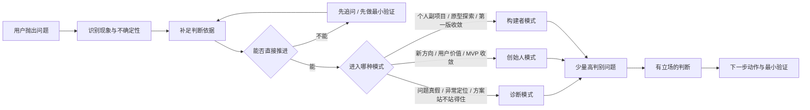
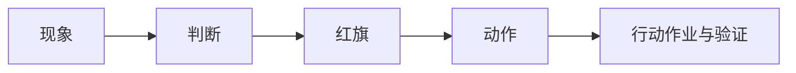

# 产品思维

高质量 AI 协作，不靠把产品分析写得更长，而靠让思考链路更可控：先识别现象与不确定性，再补足判断依据，再决定推进方式，最后落到动作与验证。

[](https://github.com/ssdiwu/product-thinking/stargazers)
[](https://github.com/ssdiwu/product-thinking/network/members)
[](https://github.com/ssdiwu/product-thinking/blob/main/LICENSE)
[](https://github.com/ssdiwu/product-thinking/issues)

一个以激发思考为核心的 AI 协作技能。

它不是帮你把产品分析写得更长，而是帮你把思考做得更真、更准、更能推进。它会先判断你现在到底在想什么问题，再进入合适的思考模式，用少量高判别问题逼出真实前提、红旗信号和下一步动作。

## 这个技能是什么

它不是固定 5 阶段流水线，也不是默认全套文档输出工具。

它更像一个“产品思考教练 + 判断路由器”：

- 先识别你当前的问题类型
- 再判断信息是否足够
- 然后进入最合适的思考模式
- 只调用必要的框架
- 最后输出判断、红旗、动作与最小验证

如果你想先看当前技能“好的输入长什么样、差的输入如何被收束、输出如何从现象走到动作”，按需阅读：

- `references/examples.md`



## 三种思考模式

### 1. 诊断模式

适合：

- 判断需求是真是假
- 诊断已有产品问题
- 做风险排查
- 评审方案是否站得住

它会重点逼问：

- 你看到的现象到底是什么
- 这是解释，还是证据
- 哪个前提最可能是错的
- 最大红旗是什么

### 2. 创始人模式

适合：

- 判断新方向值不值得做
- 澄清目标用户和真实痛点
- 找差异化定位
- 收敛 MVP

它会重点逼问：

- 用户到底是谁
- 痛点到底有多真、多强
- 为什么应该由你来做
- 如果只能做一件事，先验证什么

### 3. 构建者模式

适合：

- 个人副项目
- 个人工具
- 探索性原型
- 快速收敛第一版

它会重点逼问：

- 最小可展示版本是什么
- 第一轮拿给谁看
- 什么可以先砍掉
- 一周内如何拿到真实反馈

## 它适合解决什么问题

### 想法澄清

```text
我想做一个帮助独立开发者管理用户反馈的工具，帮我看看这个方向值不值得做。
```

### 伪需求判断

```text
很多人说 AI 时代需要万能第二大脑，这到底是真问题还是概念包装？
```

### 用户理解

```text
我想服务刚入职的产品经理，但我不确定他们真正需要的是模板、知识库，还是有人带着做。
```

### MVP 收敛

```text
我现在想到很多功能，但我只想先做最值得验证的那部分，帮我收敛第一版。
```

### 已有产品诊断

```text
我们的 SaaS 注册不少，但第二周留存很差，先帮我判断问题更可能出在哪。
```

### 方案评审

```text
这是我的产品方案，请不要顺着我说，直接指出最站不住的地方和下一步怎么验证。
```

## 三条常用路径

### 路径一：先判断，再决定要不要做

适合还在想方向是否成立时使用。

```text
先别给我方案，先判断这个方向最可能成立还是最可能站不住。
```

### 路径二：先拆红旗，再决定怎么改

适合已有产品或已有方案卡住时使用。

```text
请用诊断模式帮我拆出这件事最危险的红旗，不要先安慰我。
```

### 路径三：先收敛第一版，再拿反馈

适合个人副项目、原型和探索型产品。

```text
请用构建者模式帮我把第一版收敛到一周内能做出来、能拿去给人看的程度。
```

## 它是怎么运转的

### 第一步：识别当前任务

先判断你现在最需要的到底是：

- 澄清方向
- 判断需求真假
- 理解用户任务
- 收敛 MVP
- 诊断已有问题
- 评审方案
- 设计下一步验证

### 第二步：做不确定性门控

在给建议前，它会先判断：

- 信息是否够
- 缺什么信息会改变结论
- 应该直接判断，还是先追问
- 应该先分析，还是先做最小验证

默认不会一上来问一大串背景问题。

### 第三步：进入模式内提问

每次只问少量高判别性问题，不做问卷式追问。

### 第四步：给出有立场的判断

它不会只说“这个方向有潜力”“可以进一步优化”。

它会尽量明确说清：

- 当前最可能成立的判断是什么
- 哪些地方站不住
- 哪些是假设，不是事实
- 现在最值得做的动作是什么

如果这不是一轮对话能收住的任务，当前版本不会把你拖回旧的阶段流程，而是只在必要时引入轻状态层：

- `references/long-task.md`

## 默认输出是什么样

除非你明确要求别的格式，默认输出会包含：



### 1. 现象

当前已知事实、关键线索、缺失信息。

### 2. 判断

当前最可能成立的结论，并区分已知、推断、待验证。

### 3. 红旗

当前叙述里最值得警惕的模糊点、伪前提或风险点。

### 4. 动作

接下来最值得做的 1 到 3 个动作。

### 5. 行动作业与验证

一个最小可执行任务，以及成功/失败信号。

更接近真实体验的理解方式是：

- 先拿到一个有立场的判断
- 再拿到一个你接得住、能立刻推进的下一步

## 它不会默认做什么

- 不会默认跑完整流程
- 不会默认把所有框架都用一遍
- 不会默认为每个请求都生成 Mermaid 图
- 不会默认创建额外状态文件
- 不会默认要求你先回答大量问题
- 不会为了显得友好而回避判断

## 它内置了哪些框架

- 灵魂三问
- 问题发现
- JTBD
- 故事思维
- 逆向思维
- MVP / 减法思维
- 场景应用

这些框架不是默认主流程，而是按需调用的“思考镜头”。

## 适合这个技能的用法

### 用法一：让它先判断，不要先给方案

```text
先别给我方案，先判断这个问题是不是真的存在。
```

### 用法二：让它直接指出最站不住的地方

```text
不要顺着我说，直接指出这件事最站不住的前提。
```

### 用法三：让它给你一个行动作业

```text
别给我太多建议，只给我下一步最值得做的一件事。
```

### 用法四：让它按模式工作

```text
请用创始人模式帮我判断这个方向。
```

或者：

```text
请用诊断模式帮我看这个产品问题。
```

## 安装

### 方式一：加载 `.skill` 文件

把 `product-thinking.skill` 拖进对话，告诉 AI：

```text
安装这个技能文件
```

### 方式二：克隆仓库

```bash
cd ~/.claude/skills/
git clone https://github.com/ssdiwu/product-thinking.git
```

## 这个技能背后的核心立场

高质量 AI 协作，不靠把 prompt 写得更长，而靠把思考链路做得更可控。

具体来说，就是：

- 先识别现象
- 再识别不确定性
- 再补判断依据
- 再做有立场的判断
- 最后落到动作和验证
