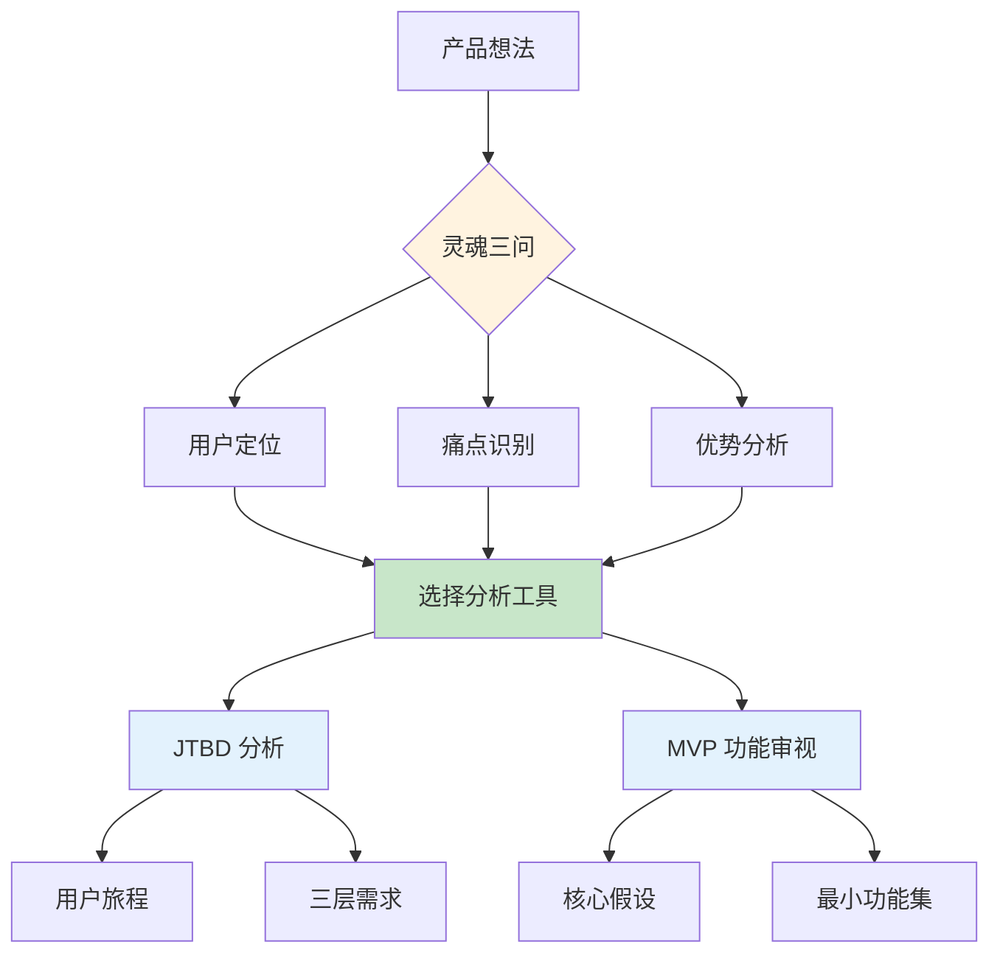
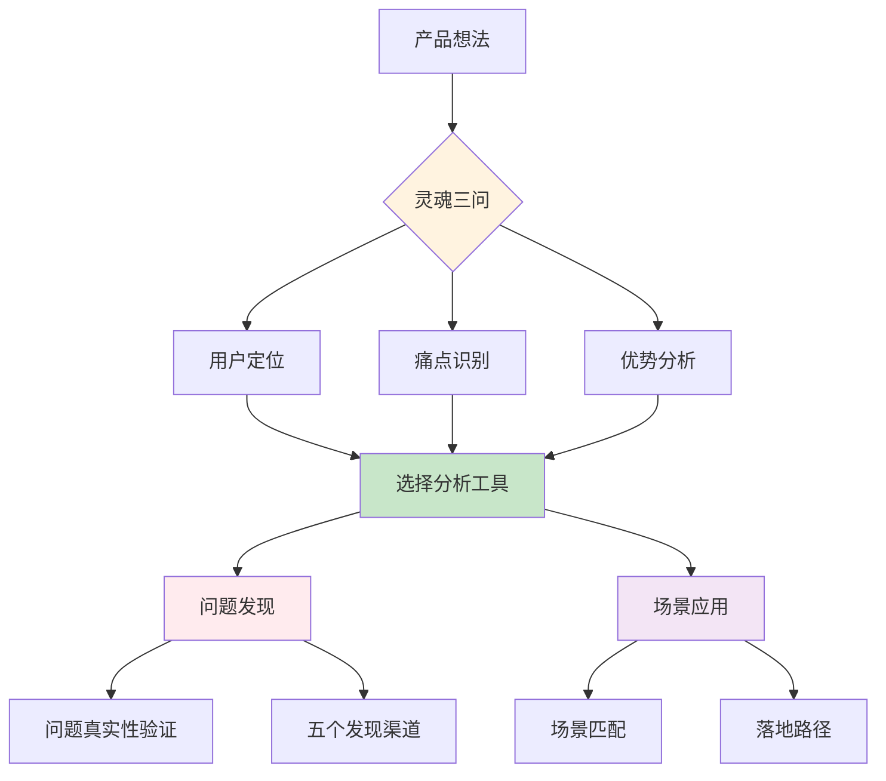

# 阶段 1: 启动(Kickoff)

## 目录
- [问答引导流程](#问答引导流程)
- [工具选择决策树](#工具选择决策树)
- [分析框架生成](#分析框架生成)
- [状态初始化](#状态初始化)

---

## 问答引导流程

按以下顺序收集信息(每轮最多问 3 个问题,避免信息过载):

### 第 1 轮: 灵魂三问

**必须明确的三个问题**:

1. **谁是用户?**
   - 具体人群,避免"所有人"
   - 模糊时的追问: `"能描述一个典型用户吗?年龄/职业/使用场景?"`

2. **痛点是什么?**
   - 真实问题,非伪需求
   - 模糊时的追问: `"用户现在怎么解决这个问题?哪里不爽?"`

3. **为什么选择你?**
   - 独特优势/资源/视角
   - 模糊时的追问: `"大厂为什么没做/没做好?你有什么独特资源?"`

### 第 2 轮: 客户画像深化(B2B 时启用)

如果是 B2B 产品,需要深化客户画像:

| 维度 | 关键问题 | 示例 |
|------|----------|------|
| **行业/领域** | 目标客户在哪些行业? | SaaS/电商/金融/教育/医疗 |
| **公司规模** | 多大体量的公司? | 初创(1-10人)/小型(10-50人)/中型(50-500人)/大型(500+) |
| **地理位置** | 有地域限制吗? | 本地/全国/全球 |
| **技术栈** | 使用什么技术/工具? | `检测到使用 React/Node.js/WordPress 等` |
| **增长信号** | 哪些信号表明他们有需求? | 正在扩招该岗位/刚发布相关产品/频繁提及痛点 |
| **预算能力** | 有预算付费吗? | 有融资记录/采购预算可见/已在采购类似产品 |

---

## 工具选择决策树

根据用户需求,使用决策树选择工具:

```
                    ┌─────────────────────────────────┐
                    │         用户想法/问题           │
                    └─────────────────────────────────┘
                                       │
                    ┌──────────────────┼──────────────────┐
                    │                  │                  │
                    ▼                  ▼                  ▼
        ┌───────────────────┐ ┌──────────────┐ ┌─────────────────┐
        │ 不确定问题是否     │ │ 想验证可行性/│ │ 功能太多不知    │
        │ 真实?             │ │ 担心失败     │ │ 从何下手        │
        └─────────┬─────────┘ └──────┬───────┘ └────────┬────────┘
                  │                  │                   │
                  ▼                  ▼                   ▼
            【问题发现】      【逆向思维】         【减法思维/MVP】
           problem-discovery  (事前验尸)           (MVP)
                                        │
                    ┌───────────────────┼──────────────────┐
                    │                   │                   │
                    ▼                   ▼                   ▼
        ┌───────────────────┐ ┌──────────────┐ ┌─────────────────┐
        │ 不确定用户真正    │ │ 想不到应用   │ │ 快速判断即可    │
        │ 需要什么?         │ │ 场景?       │ │                 │
        └─────────┬─────────┘ └──────┬───────┘ └────────┬────────┘
                  │                  │                   │
                  ▼                  ▼                   ▼
          【JTBD】或【故事思维】   【场景应用】      【灵魂三问】
```

### 工具选择速查表

| 场景 | 推荐工具 | 何时需要 |
|------|----------|----------|
| 不确定问题是否真实 | 问题发现 | 用户自己也不确定这是否是个问题 |
| 不确定用户真正需求 | JTBD、故事思维 | 想深入理解用户动机和使用场景 |
| 想验证可行性/担心失败 | 逆向思维(事前验尸) | 需要风险评估和预防措施 |
| 功能太多不知从何下手 | 减法思维(MVP) | 需要明确核心假设和最小功能集 |
| 想不到应用场景 | 场景应用 | 有想法但不知道适合哪里落地 |
| 快速判断方向 | 灵魂三问 | 只需要快速评估,不需要深度分析 |

**重要原则**: 不必每次都用全部工具,按需选择。

---

## 分析框架生成

### 框架图模板

根据选定的工具,生成对应的分析框架图:

#### 示例 1: JTBD + MVP



#### 示例 2: 场景应用 + 问题发现



### 用户确认话术

**框架确认话术模板**:
```
我们梳理出的分析框架如下:
- 目标用户: [具体人群]
- 核心痛点: [真实问题]
- 分析工具: [选择的工具及原因]

我已经生成了分析框架图(见上方),您看这个分析方向可以吗?或者有需要调整的地方吗?
```

**在得到用户肯定答复前,严禁进入下一步。**

---

## 状态初始化

### 更新 project.yaml

Kickoff 阶段完成后,必须更新 `project.yaml`:

```yaml
# 更新产品信息
product:
  name: "[产品名称]"
  type: "new_product"  # 或 existing_product
  target_user: "[从灵魂三问提取]"
  pain_point: "[从灵魂三问提取]"
  unique_advantage: "[从灵魂三问提取]"

# 更新选定的分析工具
analysis_tools:
  selected: [jtbd, mvp]  # 根据实际选择填充

# 更新客户画像(如果是 B2B)
customer_profile:
  enabled: true
  industry: "[具体行业]"
  company_size: "[公司规模]"
  decision_maker: "[决策者角色]"
  tech_stack: "[技术栈]"
  demand_signal: "[需求信号]"

# 更新阶段状态
phase: "kickoff"
phases:
  kickoff:
    status: "completed"
    completed_at: "2026-02-12T01:20:00Z"

# 更新验收标准
acceptance_criteria:
  kickoff:
    - name: "灵魂三问已回答"
      status: true
    - name: "分析工具已选定"
      status: true
    - name: "project.yaml 已初始化"
      status: true
    - name: "用户确认分析框架"
      status: true
```

### 生成 phases/01-kickoff.md

填充模板,包含:
- 灵魂三问的具体回答
- 客户画像(如果适用)
- 选定的分析工具及理由
- 分析框架图
- 用户确认状态

---

## 阶段切换检查清单

在切换到 Analysis 阶段前,必须验证:

- [ ] `phases/01-kickoff.md` 已生成
- [ ] 灵魂三问已回答
- [ ] 分析工具已选定(至少 1 个)
- [ ] `project.yaml` 已更新
- [ ] 用户已确认分析框架
- [ ] `project.yaml` 的 `phase` 字段更新为 "analysis"

---

## 常见问题

### Q: 如果用户不确定选择哪些工具?

**A**: 根据决策树主动推荐,并说明理由。例如:
```
根据您的描述,我建议使用以下工具:
1. JTBD 分析 - 因为您提到"不确定用户真正需要什么"
2. MVP 功能审视 - 因为您提到"功能太多不知从何下手"

这样可以先深入理解用户需求,再明确核心功能。您觉得如何?
```

### Q: 如果是已有产品的诊断?

**A**: 优先选择以下工具:
1. **灵魂三问** - 重新审视用户定位/痛点/优势
2. **逆向思维** - 假设产品失败,倒推可能原因
3. **问题发现** - 验证当前问题是否真实存在

### Q: 客户画像深化是否必需?

**A**: 仅在以下情况启用:
- 产品类型是 B2B
- 用户是企业/团队而非个人
- 需要精准定位目标客户

---

**维护者**: 507
**创建时间**: 2026-02-12T01:17:00Z
**基于**: ai-team/references/01-kickoff.md
