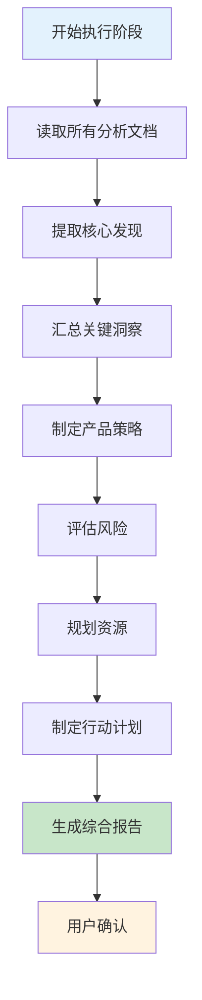
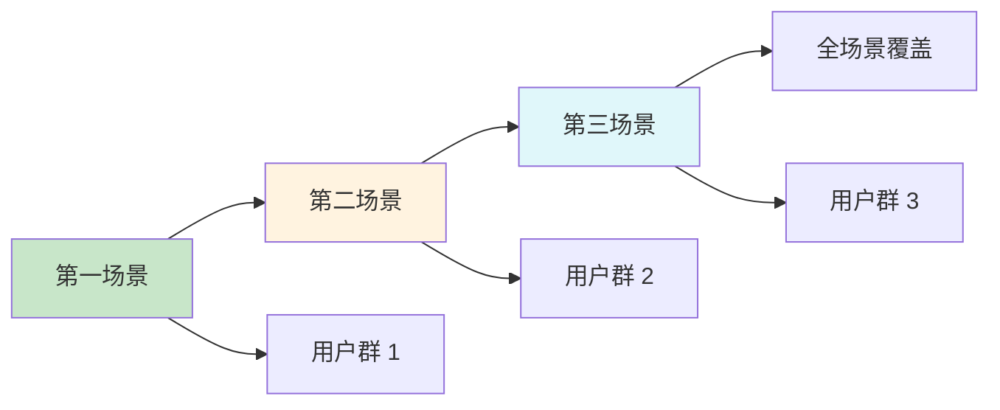
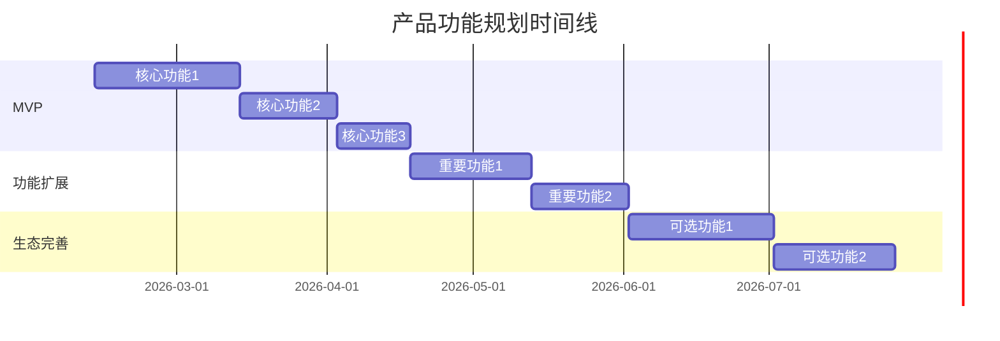

# 阶段 3: 执行(Execution)

## 目录
- [阶段目标](#阶段目标)
- [综合分析报告生成](#综合分析报告生成)
- [可视化图表汇总](#可视化图表汇总)
- [报告结构说明](#报告结构说明)
- [阶段切换检查清单](#阶段切换检查清单)

---

## 阶段目标

Execution 阶段的核心目标是:
1. **汇总分析结果**: 将所有分析工具的输出整合到一份综合报告中
2. **提炼关键洞察**: 从大量分析数据中提炼出可执行的洞察
3. **制定行动计划**: 基于分析结果,制定具体的下一步行动
4. **可视化呈现**: 使用图表和表格,让分析结果更直观

---

## 综合分析报告生成

### 报告生成流程



---

### 报告生成步骤

#### 1. 读取所有分析文档

**需要读取的文档**:
- `phases/01-kickoff.md` - 灵魂三问和工具选择
- `phases/02-jtbd.md` - JTBD 分析(如果使用)
- `phases/03-mvp.md` - MVP 功能审视(如果使用)
- `phases/04-scenarios.md` - 场景应用分析(如果使用)
- `phases/05-diagnosis.md` - 问题发现诊断(如果使用)

**读取方法**:
```bash
# 使用 Read 工具逐个读取
Read phases/01-kickoff.md
Read phases/02-jtbd.md
...
```

---

#### 2. 提取核心发现

从每个分析文档中提取"核心发现"部分:

**JTBD 分析**:
- 用户的核心任务
- 最重要的需求层
- 我们的独特价值

**MVP 功能审视**:
- 最核心的假设
- 最小功能集
- 验证周期

**场景应用分析**:
- 最佳场景
- 切入策略
- 扩展路径

**问题发现诊断**:
- 问题真实性
- 问题根因
- 解决方案方向

---

#### 3. 汇总关键洞察

将所有核心发现整合成 3-5 个关键洞察:

**洞察提炼原则**:
- 具体可执行
- 有数据支撑
- 有明确的行动方向
- 避免空洞的描述

**示例**:
- ❌ 低质量洞察: "用户需要更好的体验"
- ✅ 高质量洞察: "用户在快速切换账号时遇到 3 秒延迟,导致 40% 的用户放弃操作"

---

#### 4. 制定产品策略

基于关键洞察,制定产品策略:

**目标用户画像**:
- 从灵魂三问和 JTBD 分析中提取
- 包含基本信息、痛点描述、需求层次

**产品定位**:
- 一句话定位
- 差异化优势
- 价值主张

**功能规划**:
- 第一阶段: MVP(最小可行产品)
- 第二阶段: 功能扩展
- 第三阶段: 生态完善

**场景切入策略**:
- 第一场景选择及理由
- 切入路径
- 场景扩展路径

---

#### 5. 评估风险

识别并评估潜在风险:

**风险分类**:
- 高风险项: 影响大、概率高
- 中风险项: 影响中、概率中
- 低风险项: 影响小、概率低

**风险评估维度**:
- 影响: 对产品成功的影响程度
- 概率: 风险发生的可能性
- 应对措施: 如何降低或规避风险

---

#### 6. 规划资源

明确实现产品所需的资源:

**人力资源**:
- 角色、人数、职责、时间投入

**技术资源**:
- 资源类型、具体需求、预算

**时间资源**:
- 阶段、时间、里程碑

---

#### 7. 制定行动计划

将策略转化为具体的行动:

**立即行动(本周)**:
- 3-5 个具体行动
- 每个行动都有明确的负责人和截止时间

**短期行动(本月)**:
- 3-5 个具体行动
- 支撑 MVP 开发

**中期行动(本季度)**:
- 3-5 个具体行动
- 支撑产品发布和验证

---

#### 8. 生成综合报告

将所有内容整合到 `analysis/综合分析.md` 文档中:

**报告结构**:
1. 项目概览
2. 执行摘要
3. 分析工具输出汇总
4. 产品策略建议
5. 风险评估
6. 资源需求
7. 下一步行动
8. 附录

---

#### 9. 用户确认

**确认话术**:
```
我已经生成了综合分析报告,包含以下内容:
- 执行摘要: [关键洞察]
- 产品策略: [目标用户/产品定位/功能规划]
- 场景切入: [第一场景及切入路径]
- 风险评估: [高风险项及应对措施]
- 下一步行动: [立即行动/短期行动/中期行动]

完整报告见: analysis/综合分析.md

您看这个综合分析是否全面?是否有需要补充或调整的地方?
```

**确认状态**: [ ] 用户已确认

---

## 可视化图表汇总

### 场景扩展路径图

使用 Mermaid 的 `graph` 图表,展示从第一场景到全场景覆盖的路径:



**说明**:
- 绿色: 第一场景(立即切入)
- 橙色: 第二场景(短期扩展)
- 蓝色: 第三场景(中期扩展)

---

### 功能规划时间线

使用 Mermaid 的 `gantt` 图表,展示功能开发的时间规划:



**说明**:
- MVP 阶段: 核心功能开发
- 功能扩展阶段: 重要功能开发
- 生态完善阶段: 可选功能开发

---

### 风险矩阵图

使用 Mermaid 的 `quadrantChart` 图表,展示风险的影响和概率:

```mermaid
quadrantChart
    title 风险评估矩阵
    x-axis 低概率 --> 高概率
    y-axis 低影响 --> 高影响
    quadrant-1 高风险(立即应对)
    quadrant-2 中风险(密切关注)
    quadrant-3 低风险(接受)
    quadrant-4 中风险(制定预案)
    风险1: [0.8, 0.9]
    风险2: [0.6, 0.7]
    风险3: [0.3, 0.4]
    风险4: [0.2, 0.3]
```

**说明**:
- 第一象限: 高概率、高影响 → 立即应对
- 第二象限: 低概率、高影响 → 制定预案
- 第三象限: 低概率、低影响 → 接受
- 第四象限: 高概率、低影响 → 密切关注

---

## 报告结构说明

### 项目概览

**目的**: 快速了解项目的基本信息

**内容**:
- 产品名称
- 分析日期
- 使用的分析工具

---

### 执行摘要

**目的**: 提供高层次的总结,让读者快速抓住重点

**内容**:
- 核心发现(从灵魂三问提取)
- 关键洞察(从分析工具提取)

**长度**: 不超过 1 页

---

### 分析工具输出汇总

**目的**: 汇总所有分析工具的核心发现

**内容**:
- JTBD 分析(如果使用)
- MVP 功能审视(如果使用)
- 场景应用分析(如果使用)
- 问题发现诊断(如果使用)

**格式**: 每个工具一个小节,包含核心发现和参考文档链接

---

### 产品策略建议

**目的**: 基于分析结果,提供可执行的产品策略

**内容**:
- 目标用户画像
- 产品定位
- 功能规划(三个阶段)
- 场景切入策略

**格式**: 结构化的表格和列表,配合 Mermaid 图表

---

### 风险评估

**目的**: 识别潜在风险,制定应对措施

**内容**:
- 高风险项
- 中风险项
- 低风险项(可选)

**格式**: 表格,包含风险、影响、概率、应对措施

---

### 资源需求

**目的**: 明确实现产品所需的资源

**内容**:
- 人力资源
- 技术资源
- 时间资源

**格式**: 表格,包含资源类型、具体需求、预算/时间

---

### 下一步行动

**目的**: 将策略转化为具体的行动

**内容**:
- 立即行动(本周)
- 短期行动(本月)
- 中期行动(本季度)

**格式**: 带复选框的列表,每个行动都有明确的描述

---

### 附录

**目的**: 提供参考文档和补充信息

**内容**:
- 参考文档链接
- 可视化图表汇总

---

## 阶段切换检查清单

在切换到 Review 阶段前,必须验证:

- [ ] `analysis/综合分析.md` 已生成
- [ ] 报告包含所有必需的章节
- [ ] 所有分析工具的核心发现都已汇总
- [ ] 产品策略建议已制定
- [ ] 风险评估已完成
- [ ] 资源需求已明确
- [ ] 下一步行动已列出
- [ ] 用户已确认综合分析报告
- [ ] `project.yaml` 的 `phase` 字段更新为 "review"
- [ ] `project.yaml` 的 `phases.execution.status` 更新为 "completed"

---

## 常见问题

### Q: 如果某个分析工具没有使用,报告中如何处理?

**A**: 在"分析工具输出汇总"部分,只包含实际使用的工具。未使用的工具不需要出现在报告中。

### Q: 如果用户对综合报告不满意?

**A**: 可以:
1. 回到 Analysis 阶段,补充或调整分析
2. 重新提炼关键洞察
3. 调整产品策略建议
4. 重新生成综合报告

### Q: 综合报告的长度应该是多少?

**A**: 建议:
- 执行摘要: 1 页
- 分析工具输出汇总: 2-3 页
- 产品策略建议: 3-4 页
- 风险评估: 1-2 页
- 资源需求: 1 页
- 下一步行动: 1 页
- 总计: 10-15 页

### Q: 如何确保报告的可执行性?

**A**: 关键原则:
1. 洞察必须具体,有数据支撑
2. 策略必须有明确的行动路径
3. 行动必须有负责人和截止时间
4. 避免空洞的描述和模糊的建议

---

**维护者**: 507
**创建时间**: 2026-02-12T01:24:00Z
**基于**: ai-team/references/03-execution.md
