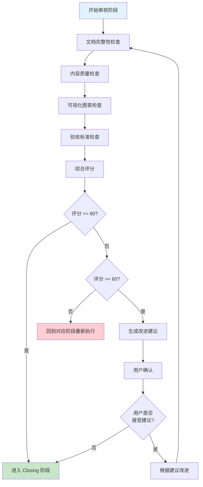

# 阶段 4: 审核(Review)

## 目录
- [阶段目标](#阶段目标)
- [完整性检查流程](#完整性检查流程)
- [检查维度说明](#检查维度说明)
- [评分标准](#评分标准)
- [改进建议生成](#改进建议生成)
- [阶段切换检查清单](#阶段切换检查清单)

---

## 阶段目标

Review 阶段的核心目标是:
1. **文档完整性检查**: 确保所有必需的文档都已生成且内容完整
2. **内容质量检查**: 确保分析结果的逻辑一致性、数据支撑和可执行性
3. **可视化图表检查**: 确保所有 Mermaid 图表都已生成且质量合格
4. **验收标准检查**: 确保每个阶段的验收标准都已满足
5. **综合评分**: 给出整体质量评分,决定是否进入下一阶段

---

## 完整性检查流程



---

## 检查维度说明

### 1. 文档完整性检查

**目的**: 确保所有必需的文档都已生成且内容完整

**检查对象**:
- `phases/01-kickoff.md` - Kickoff 阶段文档
- `phases/02-jtbd.md` - JTBD 分析(如果使用)
- `phases/03-mvp.md` - MVP 功能审视(如果使用)
- `phases/04-scenarios.md` - 场景应用分析(如果使用)
- `phases/05-diagnosis.md` - 问题发现诊断(如果使用)
- `analysis/综合分析.md` - 综合分析报告

**检查方法**:
1. 使用 Read 工具读取每个文档
2. 对照模板,检查每个必填项是否已填充
3. 统计完整性百分比
4. 列出缺失项

**评分标准**:
- 100 分: 所有必填项都已填充
- 90-99 分: 缺少 1-2 个非关键项
- 80-89 分: 缺少 3-5 个非关键项
- 70-79 分: 缺少 6-10 个非关键项或 1-2 个关键项
- <70 分: 缺少大量必填项

---

### 2. 内容质量检查

**目的**: 确保分析结果的逻辑一致性、数据支撑和可执行性

#### 2.1 逻辑一致性

**检查项**:
- 灵魂三问与分析工具的结论是否一致
- 各分析工具之间的结论是否矛盾
- 产品策略与分析结果是否一致
- 功能规划与 MVP 假设是否对应
- 场景切入与用户画像是否匹配

**检查方法**:
1. 提取各文档的核心结论
2. 对比结论之间的关系
3. 识别矛盾和不一致
4. 评估一致性程度

**评分标准**:
- 100 分: 完全一致,无矛盾
- 90-99 分: 基本一致,有 1-2 处小矛盾
- 80-89 分: 大部分一致,有 3-5 处小矛盾
- 70-79 分: 部分一致,有明显矛盾
- <70 分: 大量矛盾,逻辑混乱

---

#### 2.2 数据支撑

**检查项**:
- 关键洞察是否有数据支撑
- 用户痛点是否有具体案例
- 竞品对比是否有事实依据
- 风险评估是否有合理依据
- 验证指标是否有明确目标值

**检查方法**:
1. 识别所有需要数据支撑的结论
2. 检查每个结论是否有对应的数据/案例/依据
3. 评估数据的可信度和相关性
4. 统计数据支撑的覆盖率

**评分标准**:
- 100 分: 所有关键结论都有充分的数据支撑
- 90-99 分: 大部分关键结论有数据支撑
- 80-89 分: 部分关键结论有数据支撑
- 70-79 分: 少量关键结论有数据支撑
- <70 分: 大部分结论缺乏数据支撑

---

#### 2.3 可执行性

**检查项**:
- 产品策略是否具体可执行
- 功能规划是否有明确的优先级
- 场景切入是否有清晰的路径
- 下一步行动是否有负责人和截止时间
- 资源需求是否有具体的预算和时间

**检查方法**:
1. 识别所有需要执行的策略/行动
2. 检查每个策略/行动是否具体可执行
3. 评估执行的可行性
4. 统计可执行性的覆盖率

**评分标准**:
- 100 分: 所有策略/行动都具体可执行
- 90-99 分: 大部分策略/行动可执行
- 80-89 分: 部分策略/行动可执行
- 70-79 分: 少量策略/行动可执行
- <70 分: 大部分策略/行动不可执行

---

### 3. 可视化图表检查

**目的**: 确保所有 Mermaid 图表都已生成且质量合格

#### 3.1 图表完整性

**检查项**:
- Kickoff 阶段: 分析框架图
- JTBD 分析: 用户旅程图、三层需求思维导图
- MVP 功能审视: 功能分层图、MVP 决策流程图
- 场景应用分析: 场景分析图、场景优先级排序图
- 问题发现诊断: 问题分析树、问题根因分析图
- 综合分析: 场景扩展路径图、功能规划时间线、风险矩阵图

**检查方法**:
1. 列出所有应该生成的图表
2. 检查每个图表是否存在
3. 统计图表完整性百分比

**评分标准**:
- 100 分: 所有图表都已生成
- 90-99 分: 缺少 1 个非关键图表
- 80-89 分: 缺少 2-3 个非关键图表
- 70-79 分: 缺少 4-5 个非关键图表或 1 个关键图表
- <70 分: 缺少大量图表

---

#### 3.2 图表质量

**检查项**:
- 图表语法是否正确,可以正常渲染
- 图表内容与文档描述是否一致
- 图表是否使用了合适的颜色标注
- 图表结构是否清晰,易于理解
- 图表标题和说明是否完整

**检查方法**:
1. 尝试渲染每个图表
2. 对比图表内容与文档描述
3. 评估图表的可读性和美观性
4. 统计图表质量的覆盖率

**评分标准**:
- 100 分: 所有图表质量都很高
- 90-99 分: 大部分图表质量高,有 1-2 个小问题
- 80-89 分: 部分图表质量高,有 3-5 个小问题
- 70-79 分: 少量图表质量高,有明显问题
- <70 分: 大部分图表质量低

---

### 4. 验收标准检查

**目的**: 确保每个阶段的验收标准都已满足

#### 4.1 Kickoff 阶段验收标准

**检查项**:
- [ ] 灵魂三问已回答
- [ ] 分析工具已选定
- [ ] project.yaml 已初始化
- [ ] 用户确认分析框架

**评分标准**:
- 100 分: 所有验收标准都满足
- 75 分: 缺少 1 个验收标准
- 50 分: 缺少 2 个验收标准
- 25 分: 缺少 3 个验收标准
- 0 分: 所有验收标准都不满足

---

#### 4.2 Analysis 阶段验收标准

**检查项**:
- [ ] 所有选定的分析工具都已执行
- [ ] 每个工具的输出文档都已生成
- [ ] 每个工具的核心发现都已明确
- [ ] 用户已确认所有分析结果

**评分标准**:
- 100 分: 所有验收标准都满足
- 75 分: 缺少 1 个验收标准
- 50 分: 缺少 2 个验收标准
- 25 分: 缺少 3 个验收标准
- 0 分: 所有验收标准都不满足

---

#### 4.3 Execution 阶段验收标准

**检查项**:
- [ ] 综合分析报告已生成
- [ ] 报告包含所有必需的章节
- [ ] 所有分析工具的核心发现都已汇总
- [ ] 产品策略建议已制定
- [ ] 风险评估已完成
- [ ] 资源需求已明确
- [ ] 下一步行动已列出
- [ ] 用户已确认综合分析报告

**评分标准**:
- 100 分: 所有验收标准都满足
- 87.5 分: 缺少 1 个验收标准
- 75 分: 缺少 2 个验收标准
- 62.5 分: 缺少 3 个验收标准
- 50 分: 缺少 4 个验收标准
- <50 分: 缺少 5 个或更多验收标准

---

## 评分标准

### 综合评分计算

**评分公式**:
```
总分 = 文档完整性 × 30% + 内容质量 × 30% + 可视化图表 × 20% + 验收标准 × 20%
```

**权重说明**:
- **文档完整性**(30%): 最基础的要求,文档必须完整
- **内容质量**(30%): 最核心的要求,内容必须高质量
- **可视化图表**(20%): 重要但非核心,图表提升可读性
- **验收标准**(20%): 重要但非核心,确保流程规范

---

### 评分等级

| 等级 | 分数范围 | 说明 | 下一步行动 |
|------|---------|------|-----------|
| **优秀** | 90-100 | 所有检查项都通过,质量很高 | 直接进入 Closing 阶段 |
| **良好** | 80-89 | 大部分检查项通过,有少量改进空间 | 直接进入 Closing 阶段 |
| **合格** | 70-79 | 基本检查项通过,有一些需要改进的地方 | 根据改进建议完善后进入 Closing 阶段 |
| **需改进** | 60-69 | 部分检查项未通过,需要补充和改进 | 根据改进建议完善后重新审核 |
| **不合格** | <60 | 大量检查项未通过,需要重新执行 | 回到对应阶段重新执行 |

---

## 改进建议生成

### 改进建议优先级

**高优先级**: 影响核心质量的问题
- 文档完整性 < 80 分
- 逻辑一致性 < 80 分
- 数据支撑 < 70 分
- 关键验收标准未满足

**中优先级**: 影响整体质量的问题
- 可执行性 < 80 分
- 图表完整性 < 80 分
- 非关键验收标准未满足

**低优先级**: 影响细节质量的问题
- 图表质量 < 80 分
- 文档格式问题
- 小的逻辑不一致

---

### 改进建议模板

```markdown
### [优先级] 改进项 X: [简短描述]

**当前问题**: [具体描述问题]

**影响**: [这个问题会导致什么后果]

**改进建议**: [具体的改进步骤]

**预计时间**: [完成改进需要的时间]

**负责人**: [谁来负责改进]
```

---

## 阶段切换检查清单

### 进入 Closing 阶段的条件

- [ ] 综合评分 >= 80 分
- [ ] 所有高优先级改进项已完成
- [ ] 用户已确认审核结果
- [ ] `project.yaml` 的 `phase` 字段更新为 "closing"
- [ ] `project.yaml` 的 `phases.review.status` 更新为 "completed"

---

### 回到对应阶段的条件

- [ ] 综合评分 < 60 分
- [ ] 存在大量高优先级改进项
- [ ] 用户要求重新执行

---

## 常见问题

### Q: 如果某个阶段的文档缺失,应该怎么办?

**A**:
1. 在完整性检查报告中明确指出缺失的文档
2. 评估缺失文档的重要性
3. 如果是关键文档,回到对应阶段重新生成
4. 如果是非关键文档,可以在改进建议中列出

### Q: 如果发现逻辑矛盾,应该怎么办?

**A**:
1. 在内容质量检查中明确指出矛盾点
2. 分析矛盾的原因(数据不足、分析角度不同等)
3. 建议回到对应阶段重新分析
4. 或者在综合分析中明确说明矛盾及其原因

### Q: 如果用户对评分不满意,应该怎么办?

**A**:
1. 与用户讨论评分标准是否合理
2. 如果用户认为某些维度不重要,可以调整权重
3. 如果用户认为某些检查项不必要,可以跳过
4. 重新计算评分

### Q: 如果评分在 60-79 分之间,应该怎么办?

**A**:
1. 生成详细的改进建议
2. 与用户讨论是否接受改进建议
3. 如果用户接受,根据建议改进后重新审核
4. 如果用户不接受,可以直接进入 Closing 阶段(但需要在最终报告中说明)

---

**维护者**: 507
**创建时间**: 2026-02-12T01:26:00Z
**基于**: ai-team/references/04-review.md
