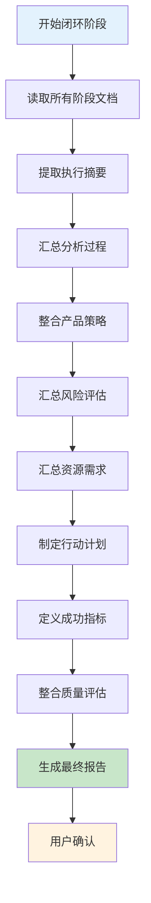
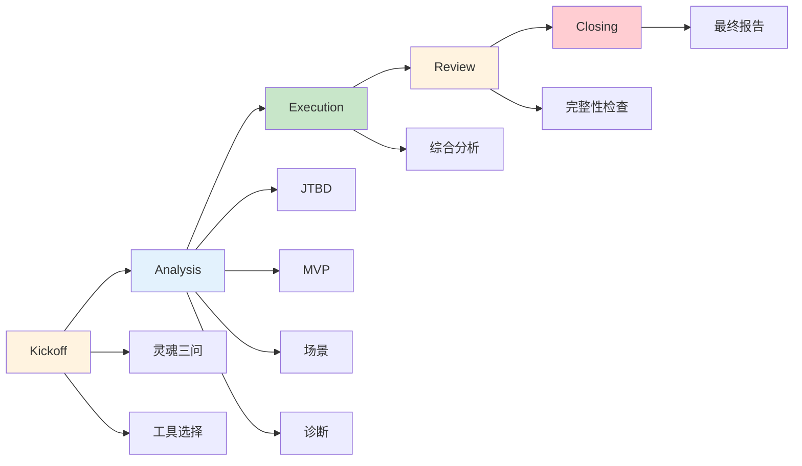

# 阶段 5: 闭环(Closing)

## 目录
- [阶段目标](#阶段目标)
- [最终报告生成流程](#最终报告生成流程)
- [报告生成步骤](#报告生成步骤)
- [报告结构说明](#报告结构说明)
- [质量评估整合](#质量评估整合)
- [阶段切换检查清单](#阶段切换检查清单)

---

## 阶段目标

Closing 阶段的核心目标是:
1. **生成最终报告**: 整合所有阶段的产出,生成完整的产品思考报告
2. **提供执行摘要**: 提炼核心发现和关键洞察,让读者快速抓住重点
3. **制定行动计划**: 将策略转化为具体的、可执行的行动
4. **定义成功指标**: 明确短期、中期、长期的验证指标
5. **完成闭环**: 确保整个产品思考过程形成完整闭环

---

## 最终报告生成流程



---

## 报告生成步骤

### 1. 读取所有阶段文档

**需要读取的文档**:
- `phases/01-kickoff.md` - 灵魂三问和工具选择
- `phases/02-jtbd.md` - JTBD 分析(如果使用)
- `phases/03-mvp.md` - MVP 功能审视(如果使用)
- `phases/04-scenarios.md` - 场景应用分析(如果使用)
- `phases/05-diagnosis.md` - 问题发现诊断(如果使用)
- `analysis/综合分析.md` - 综合分析报告
- `reviews/completeness-check.md` - 完整性检查报告

**读取方法**:
```bash
# 使用 Read 工具逐个读取
Read phases/01-kickoff.md
Read analysis/综合分析.md
Read reviews/completeness-check.md
...
```

---

### 2. 提取执行摘要

执行摘要是最终报告的核心,应该包含:

#### 2.1 项目背景

从 Kickoff 阶段提取:
- 产品名称
- 分析日期
- 使用的分析工具

#### 2.2 核心发现

从灵魂三问提取:
- **用户定位**: 谁是目标用户?
- **核心痛点**: 他们的核心痛点是什么?
- **独特优势**: 为什么他们会选择你?

#### 2.3 关键洞察

从各分析工具提取 3-5 个关键洞察:
- JTBD 分析的核心发现
- MVP 功能审视的核心发现
- 场景应用分析的核心发现
- 问题发现诊断的核心发现

**提炼原则**:
- 具体可执行
- 有数据支撑
- 有明确的行动方向
- 避免空洞的描述

#### 2.4 核心建议

从综合分析提取:
- **产品定位**: 一句话定位
- **切入场景**: 最佳场景
- **MVP 功能**: P0 功能列表
- **验证周期**: 多久可以得到反馈

---

### 3. 汇总分析过程

#### 3.1 使用的分析工具

创建一个表格,列出所有使用的分析工具:

| 工具 | 目的 | 核心发现 |
|------|------|------------|
| **灵魂三问** | 快速评估 | [从 Kickoff 提取] |
| **JTBD 分析** | 理解用户需求 | [从 JTBD 提取] |
| **MVP 功能审视** | 定义最小功能集 | [从 MVP 提取] |
| **场景应用分析** | 找到落地场景 | [从场景提取] |
| **问题发现诊断** | 验证问题真实性 | [从诊断提取] |

#### 3.2 分析流程图

使用 Mermaid 图表展示分析流程:



---

### 4. 整合产品策略

从综合分析报告中提取并整合:

#### 4.1 目标用户画像

**基本信息**:
- 年龄: [年龄范围]
- 职业: [职业类型]
- 场景: [使用场景]

**痛点描述**:
- 痛点 1: [具体描述]
- 痛点 2: [具体描述]
- 痛点 3: [具体描述]

**需求层次**:
- 功能需求: [具体需求]
- 情感需求: [具体需求]
- 社会需求: [具体需求]

#### 4.2 产品定位

**一句话定位**: [产品是什么,为谁解决什么问题]

**差异化优势**: [相比竞品的独特价值]

**价值主张**: [用户为什么选择我们]

#### 4.3 功能规划

**第一阶段: MVP(最小可行产品)**

核心功能:
1. [功能 1]: [功能描述] - 验证 [假设]
2. [功能 2]: [功能描述] - 验证 [假设]
3. [功能 3]: [功能描述] - 验证 [假设]

验证指标:
- [指标 1]: [目标值]
- [指标 2]: [目标值]
- [指标 3]: [目标值]

**第二阶段: 功能扩展**

重要功能:
1. [功能 4]: [功能描述] - 增强 [价值]
2. [功能 5]: [功能描述] - 增强 [价值]

**第三阶段: 生态完善**

可选功能:
1. [功能 6]: [功能描述] - 锦上添花
2. [功能 7]: [功能描述] - 未来扩展

#### 4.4 场景切入策略

**第一场景**: [场景名称]

为什么选择这个场景:
- 用户痛点明确且严重
- 产品价值直接且显著
- 竞争对手少或弱

切入路径:
1. [第一步]: [具体行动]
2. [第二步]: [具体行动]
3. [第三步]: [具体行动]

成功指标:
- [指标 1]: [目标值]
- [指标 2]: [目标值]

---

### 5. 汇总风险评估

从综合分析报告中提取风险评估:

#### 5.1 高风险项

| 风险 | 影响 | 概率 | 应对措施 | 负责人 |
|------|------|------|---------|--------|
| [风险 1] | [影响描述] | [高/中/低] | [应对措施] | [负责人] |
| [风险 2] | [影响描述] | [高/中/低] | [应对措施] | [负责人] |

#### 5.2 中风险项

| 风险 | 影响 | 概率 | 应对措施 | 负责人 |
|------|------|------|---------|--------|
| [风险 3] | [影响描述] | [高/中/低] | [应对措施] | [负责人] |
| [风险 4] | [影响描述] | [高/中/低] | [应对措施] | [负责人] |

---

### 6. 汇总资源需求

从综合分析报告中提取资源需求:

#### 6.1 人力资源

| 角色 | 人数 | 职责 | 时间投入 | 预算 |
|------|------|------|---------|------|
| [角色 1] | [人数] | [职责描述] | [时间] | [预算] |
| [角色 2] | [人数] | [职责描述] | [时间] | [预算] |

**总人力成本**: [总预算]

#### 6.2 技术资源

| 资源类型 | 具体需求 | 预算 | 供应商 |
|---------|---------|------|--------|
| [资源 1] | [具体描述] | [预算] | [供应商] |
| [资源 2] | [具体描述] | [预算] | [供应商] |

**总技术成本**: [总预算]

#### 6.3 时间资源

| 阶段 | 时间 | 里程碑 | 交付物 |
|------|------|--------|--------|
| MVP 开发 | [时间] | [里程碑] | [交付物] |
| 测试验证 | [时间] | [里程碑] | [交付物] |
| 正式发布 | [时间] | [里程碑] | [交付物] |

**总时间**: [总时间]

---

### 7. 制定行动计划

将策略转化为具体的行动:

#### 7.1 立即行动(本周)

- [ ] [行动 1]: [具体描述] - 负责人: [姓名] - 截止: [日期]
- [ ] [行动 2]: [具体描述] - 负责人: [姓名] - 截止: [日期]
- [ ] [行动 3]: [具体描述] - 负责人: [姓名] - 截止: [日期]

#### 7.2 短期行动(本月)

- [ ] [行动 4]: [具体描述] - 负责人: [姓名] - 截止: [日期]
- [ ] [行动 5]: [具体描述] - 负责人: [姓名] - 截止: [日期]
- [ ] [行动 6]: [具体描述] - 负责人: [姓名] - 截止: [日期]

#### 7.3 中期行动(本季度)

- [ ] [行动 7]: [具体描述] - 负责人: [姓名] - 截止: [日期]
- [ ] [行动 8]: [具体描述] - 负责人: [姓名] - 截止: [日期]
- [ ] [行动 9]: [具体描述] - 负责人: [姓名] - 截止: [日期]

---

### 8. 定义成功指标

#### 8.1 短期指标(1-3 个月)

| 指标 | 目标值 | 当前值 | 达成率 |
|------|--------|--------|--------|
| [指标 1] | [目标值] | [当前值] | [达成率] |
| [指标 2] | [目标值] | [当前值] | [达成率] |
| [指标 3] | [目标值] | [当前值] | [达成率] |

#### 8.2 中期指标(3-6 个月)

| 指标 | 目标值 | 当前值 | 达成率 |
|------|--------|--------|--------|
| [指标 4] | [目标值] | [当前值] | [达成率] |
| [指标 5] | [目标值] | [当前值] | [达成率] |
| [指标 6] | [目标值] | [当前值] | [达成率] |

#### 8.3 长期指标(6-12 个月)

| 指标 | 目标值 | 当前值 | 达成率 |
|------|--------|--------|--------|
| [指标 7] | [目标值] | [当前值] | [达成率] |
| [指标 8] | [目标值] | [当前值] | [达成率] |
| [指标 9] | [目标值] | [当前值] | [达成率] |

---

### 9. 整合质量评估

从完整性检查报告中提取质量评估结果:

#### 9.1 综合评分

**总分**: [0-100]

**评分等级**: [优秀/良好/合格/需改进/不合格]

**评分维度**:
- 文档完整性: [评分]
- 内容质量: [评分]
- 可视化图表: [评分]
- 验收标准: [评分]

**详细报告**: `reviews/completeness-check.md`

#### 9.2 改进建议

**已完成的改进项**:
1. **改进项 1**: [简短描述]
   - 改进前: [问题描述]
   - 改进后: [改进结果]

2. **改进项 2**: [简短描述]
   - 改进前: [问题描述]
   - 改进后: [改进结果]

**待完成的改进项**:
1. **改进项 3**: [简短描述]
   - 当前问题: [问题描述]
   - 改进建议: [建议]
   - 优先级: [高/中/低]

---

### 10. 生成最终报告

将所有内容整合到 `reports/final-report.md` 文档中:

**报告结构**:
1. 报告概览
2. 执行摘要
3. 分析过程回顾
4. 产品策略建议
5. 风险评估与应对
6. 资源需求
7. 行动计划
8. 成功指标
9. 质量评估
10. 附录

**生成方法**:
使用 Write 工具创建最终报告,确保:
- 所有章节都已填充
- 所有数据都从对应文档中提取
- 所有 Mermaid 图表都已生成
- 格式统一,易于阅读

---

### 11. 用户确认

**确认话术**:
```
我已经生成了最终报告,包含以下内容:

## 执行摘要
- 核心发现: [用户定位/核心痛点/独特优势]
- 关键洞察: [3-5 个关键洞察]
- 核心建议: [产品定位/切入场景/MVP 功能/验证周期]

## 产品策略
- 目标用户画像: [基本信息/痛点描述/需求层次]
- 产品定位: [一句话定位/差异化优势/价值主张]
- 功能规划: [MVP → 功能扩展 → 生态完善]
- 场景切入: [第一场景及切入路径]

## 风险与资源
- 风险评估: [高风险项及应对措施]
- 资源需求: [人力/技术/时间]

## 行动计划
- 立即行动: [本周 3-5 个行动]
- 短期行动: [本月 3-5 个行动]
- 中期行动: [本季度 3-5 个行动]

## 成功指标
- 短期指标: [1-3 个月]
- 中期指标: [3-6 个月]
- 长期指标: [6-12 个月]

## 质量评估
- 综合评分: [分数] ([等级])
- 改进建议: [已完成/待完成]

完整报告见: reports/final-report.md

您看这个最终报告是否全面?是否有需要补充或调整的地方?
```

**确认状态**: [ ] 用户已确认

---

## 报告结构说明

### 报告概览

**目的**: 提供报告的基本信息

**内容**:
- 项目名称
- 报告日期
- 报告版本
- 维护者

---

### 执行摘要

**目的**: 让读者快速抓住重点

**内容**:
- 项目背景
- 核心发现(从灵魂三问)
- 关键洞察(从分析工具)
- 核心建议(产品定位/切入场景/MVP 功能/验证周期)

**长度**: 不超过 2 页

**原则**:
- 简洁明了
- 突出重点
- 避免细节

---

### 分析过程回顾

**目的**: 展示分析的系统性和完整性

**内容**:
- 使用的分析工具
- 分析流程图
- 每个工具的核心发现

**格式**: 表格 + Mermaid 图表

---

### 产品策略建议

**目的**: 提供可执行的产品策略

**内容**:
- 目标用户画像
- 产品定位
- 功能规划(三个阶段)
- 场景切入策略

**格式**: 结构化的表格和列表,配合 Mermaid 图表

---

### 风险评估与应对

**目的**: 识别潜在风险,制定应对措施

**内容**:
- 高风险项
- 中风险项
- 低风险项(可选)

**格式**: 表格,包含风险、影响、概率、应对措施、负责人

---

### 资源需求

**目的**: 明确实现产品所需的资源

**内容**:
- 人力资源
- 技术资源
- 时间资源

**格式**: 表格,包含资源类型、具体需求、预算/时间

---

### 行动计划

**目的**: 将策略转化为具体的行动

**内容**:
- 立即行动(本周)
- 短期行动(本月)
- 中期行动(本季度)

**格式**: 带复选框的列表,每个行动都有明确的描述、负责人、截止时间

---

### 成功指标

**目的**: 定义验证产品成功的指标

**内容**:
- 短期指标(1-3 个月)
- 中期指标(3-6 个月)
- 长期指标(6-12 个月)

**格式**: 表格,包含指标、目标值、当前值、达成率

---

### 质量评估

**目的**: 展示分析过程的质量

**内容**:
- 综合评分
- 评分维度
- 改进建议(已完成/待完成)

**格式**: 表格 + 列表

---

### 附录

**目的**: 提供参考文档和补充信息

**内容**:
- 参考文档链接
- 可视化图表汇总
- 术语表
- 版本历史

---

## 质量评估整合

### 从 Review 阶段提取

在生成最终报告时,需要从 `reviews/completeness-check.md` 中提取:

#### 1. 综合评分

**评分公式**:
```
总分 = 文档完整性 × 30% + 内容质量 × 30% + 可视化图表 × 20% + 验收标准 × 20%
```

**评分等级**:
- **90-100**: 优秀
- **80-89**: 良好
- **70-79**: 合格
- **60-69**: 需改进
- **<60**: 不合格

#### 2. 评分维度

| 维度 | 权重 | 得分 | 加权得分 |
|------|------|------|---------|
| **文档完整性** | 30% | [0-100] | [加权得分] |
| **内容质量** | 30% | [0-100] | [加权得分] |
| **可视化图表** | 20% | [0-100] | [加权得分] |
| **验收标准** | 20% | [0-100] | [加权得分] |

#### 3. 改进建议

**已完成的改进项**:
- 列出在 Review 阶段完成的改进
- 说明改进前后的对比

**待完成的改进项**:
- 列出尚未完成的改进建议
- 标注优先级(高/中/低)

---

## 阶段切换检查清单

在完成 Closing 阶段前,必须验证:

- [ ] `reports/final-report.md` 已生成
- [ ] 报告包含所有必需的章节
- [ ] 执行摘要清晰简洁(不超过 2 页)
- [ ] 所有分析工具的核心发现都已汇总
- [ ] 产品策略建议已制定
- [ ] 功能规划包含三个阶段(MVP/功能扩展/生态完善)
- [ ] 场景切入策略明确
- [ ] 风险评估已完成
- [ ] 资源需求已明确
- [ ] 行动计划具体可执行
- [ ] 成功指标已定义
- [ ] 质量评估已整合
- [ ] 所有 Mermaid 图表都已生成
- [ ] 用户已确认最终报告
- [ ] `project.yaml` 的 `phase` 字段更新为 "completed"
- [ ] `project.yaml` 的 `phases.closing.status` 更新为 "completed"

---

## 常见问题

### Q: 最终报告的长度应该是多少?

**A**: 建议:
- 报告概览: 1 页
- 执行摘要: 1-2 页
- 分析过程回顾: 2-3 页
- 产品策略建议: 4-5 页
- 风险评估: 1-2 页
- 资源需求: 1 页
- 行动计划: 1-2 页
- 成功指标: 1 页
- 质量评估: 1 页
- 附录: 1-2 页
- **总计**: 15-20 页

### Q: 如果用户对最终报告不满意?

**A**: 可以:
1. 根据用户反馈调整报告内容
2. 补充缺失的信息
3. 重新提炼执行摘要
4. 调整行动计划的优先级
5. 重新生成最终报告

### Q: 最终报告可以直接用于汇报吗?

**A**: 可以。最终报告包含:
- 执行摘要(1-2 页) - 适合高层汇报
- 产品策略建议 - 适合团队讨论
- 行动计划 - 适合任务分配
- 成功指标 - 适合进度跟踪

格式专业,内容完整,可以直接用于团队汇报或投资人展示。

### Q: 如何确保最终报告的可执行性?

**A**: 关键原则:
1. **执行摘要必须简洁**: 不超过 2 页,突出重点
2. **策略必须具体**: 避免空洞的描述,提供明确的方向
3. **行动必须可执行**: 每个行动都有负责人和截止时间
4. **指标必须可衡量**: 每个指标都有明确的目标值
5. **风险必须有应对**: 每个风险都有具体的应对措施

### Q: 如何处理 Review 阶段的改进建议?

**A**: 在最终报告中:
1. **已完成的改进项**: 在"质量评估"部分说明改进前后的对比
2. **待完成的改进项**: 在"附录"部分列出,标注优先级
3. **高优先级改进项**: 如果影响核心策略,应该在报告中明确说明

### Q: 最终报告生成后,还需要做什么?

**A**: 完成 Closing 阶段后:
1. 更新 `project.yaml` 的状态为 "completed"
2. 将最终报告分享给相关人员
3. 根据行动计划,启动 MVP 开发
4. 定期跟踪成功指标,及时调整策略
5. 持续收集用户反馈,迭代产品

---

**维护者**: 507
**创建时间**: 2026-02-12T01:30:00Z
**基于**: ai-team/references/05-closing.md
