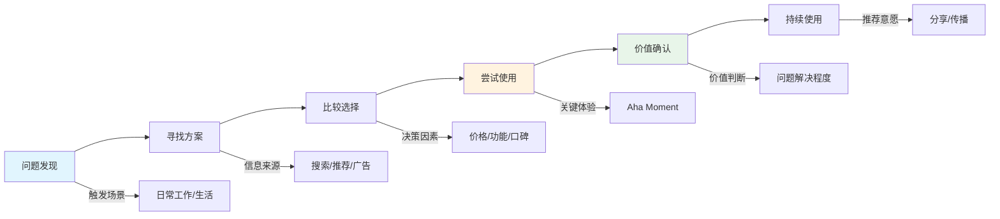
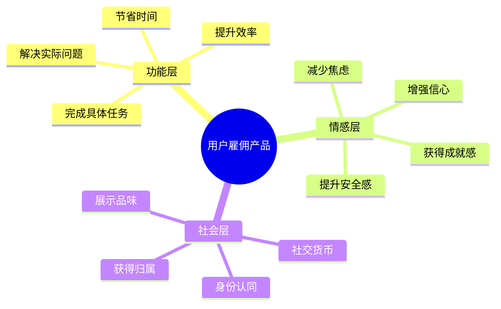
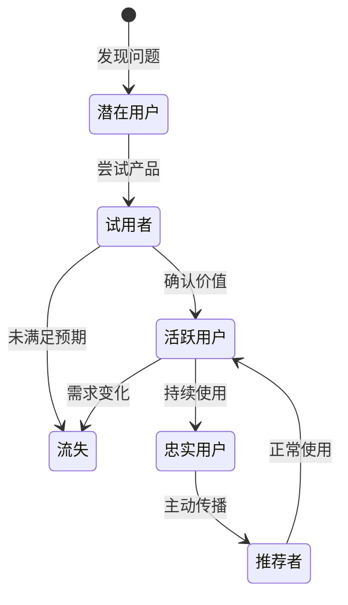

# JTBD（Jobs to be Done）理论框架

## 核心概念

用户"购买"的不是产品，而是"雇佣"产品来完成某个任务。

**经典案例**：奶昔销售研究 - 用户雇佣奶昔是为了"让早通勤更有趣/打发时间"，而不是"解渴"。

## 三个层次

### 1. 功能层任务（Functional Job）
用户想达成的具体目标。

**示例**：
- 记账工具：记录每日开支
- 待办清单：管理任务列表
- 音乐播放器：播放音乐

### 2. 情感层任务（Emotional Job）
用户希望获得的感受。

**示例**：
- 记账工具：感到财务安全、掌控感
- 待办清单：减轻焦虑、感到井井有条
- 音乐播放器：放松、专注、情绪调节

### 3. 社会层任务（Social Job）
用户希望传递给他人的印象。

**示例**：
- 记账工具：显得精明理财
- 待办清单：显得高效专业
- 音乐播放器：显得有品味

## 实践方法

### 步骤 1：识别用户当前解决方案
用户现在是如何完成这个任务的？
- 用什么产品？
- 用什么方法？
- 有什么痛点？

### 步骤 2：分析当前方案的痛点
- 哪里不方便？
- 什么地方用户会放弃？
- 用户会做什么变通方案？

### 步骤 3：发现真正想完成的任务
问自己：
- 用户为什么需要这个？
- 完成后用户希望获得什么感受？
- 这对用户的生活有什么意义？

## 实践模板

```markdown
## JTBD 分析

### 当前解决方案
用户目前如何解决这个问题？

### 功能层任务
用户想达成的具体目标是什么？

### 情感层任务
用户希望获得什么感受？

### 社会层任务
用户希望传递什么印象？
```

## 可视化示例

### 用户旅程流程图

展示用户从"问题发现"到"采用产品"的完整旅程：



### 三层需求思维导图

可视化展示用户的三层需求结构：



### 状态流转图

展示用户与产品关系的演变：



**使用建议**：
- 用户旅程流程图：用于理解用户从发现问题到采用产品的完整路径
- 三层需求思维导图：用于深入挖掘用户的真实动机
- 状态流转图：用于设计用户增长和留存策略

## 常见误区

| 误区 | 正确做法 |
|------|----------|
| 只关注功能层 | 挖掘情感和社会层 |
| 假设用户知道自己要什么 | 观察行为而非听用户说 |
| 过度关注用户属性 | 关注用户想要完成的任务 |

