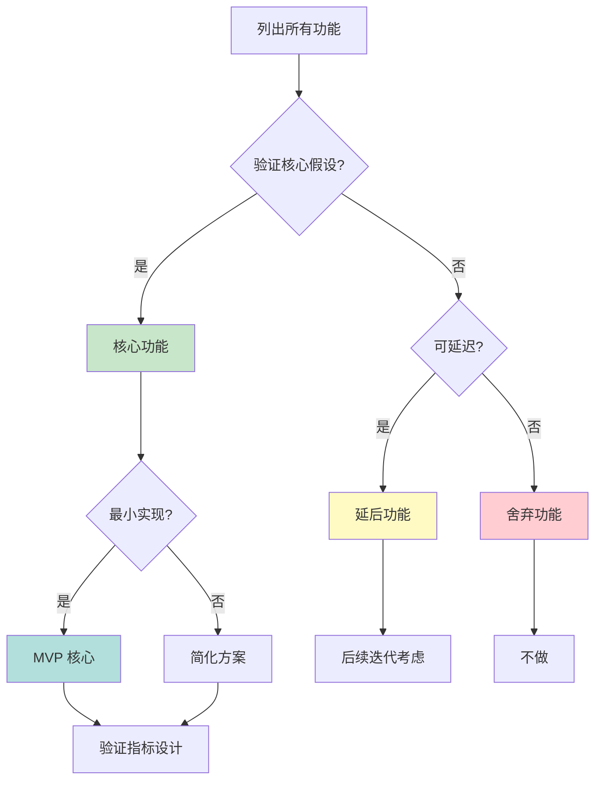
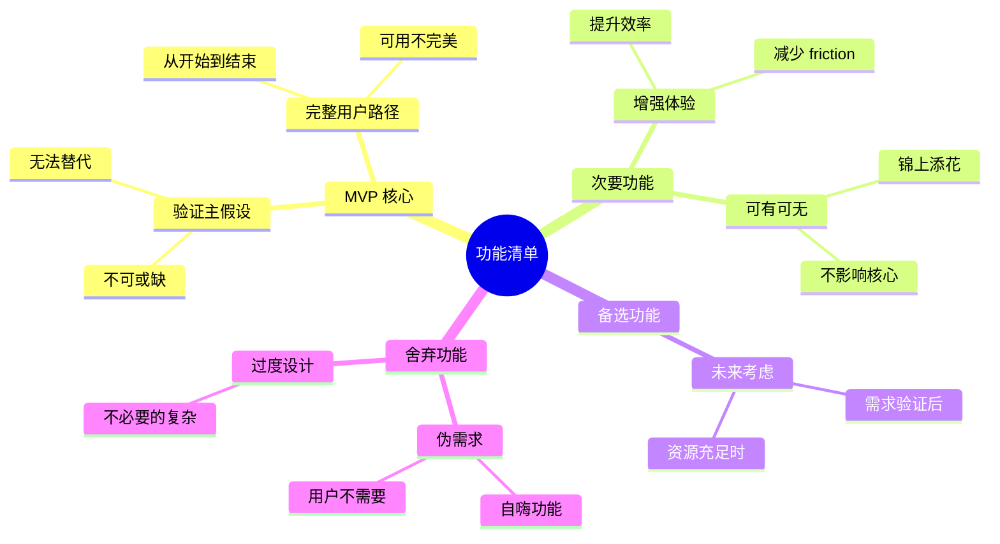
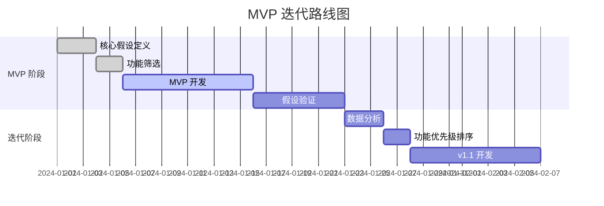
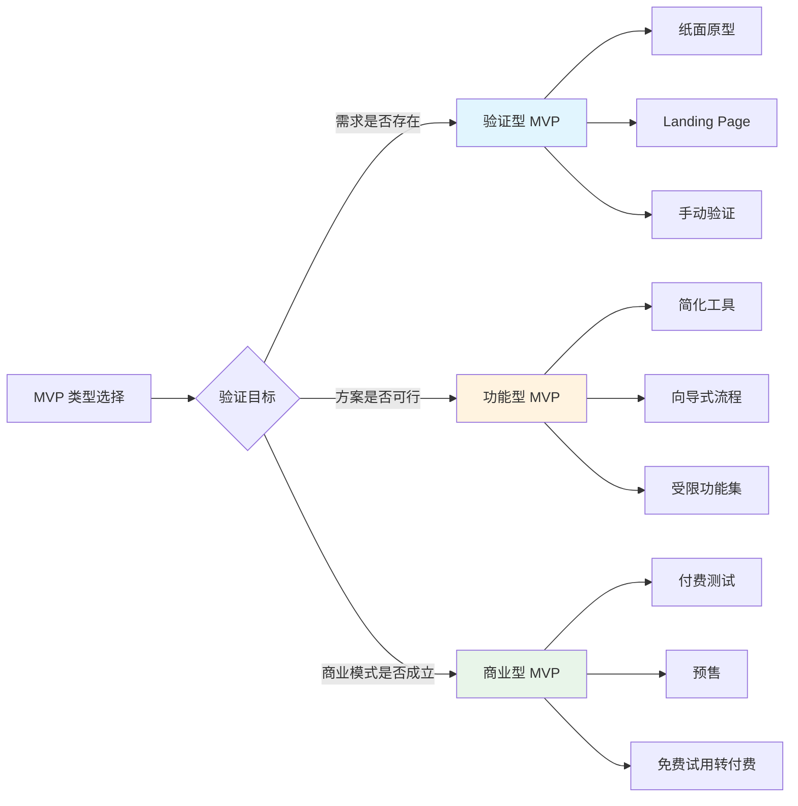

# 减法思维（MVP）理论框架

## 核心概念

**MVP（Minimum Viable Product）**：能验证核心假设的最简功能集。

关键理解：
- 不是"半成品"，而是"最小可行完整品"
- 用户愿意付费/使用的最简版本
- 用最小投入验证核心假设

## MVP 定义的本质

### 不是什么
- ❌ 不等于"简陋版产品"
- ❌ 不等于"只有核心功能的产品"
- ❌ 不等于"测试版产品"

### 是什么
- ✅ 能验证一个或多个假设的产品
- ✅ 用户能够完成完整体验的最简版本
- ✅ 可以根据反馈决定下一步方向的产品

## 核心假设

每个 MVP 应该明确要验证的假设：

```markdown
## MVP 假设

### 核心假设
1. [假设1]：用户有 [X] 痛点
2. [假设2]：用户愿意用 [Y] 方案解决
3. [假设3]：用户愿意为此付出 [Z] 成本（时间/金钱）

### 验证指标
- 假设1的验证：[具体指标]
- 假设2的验证：[具体指标]
- 假设3的验证：[具体指标]
```

## 实践方法

### 减法四步骤

**步骤 1：列出所有想要的功能**
- 不设限，把想到的全写下来
- 每个功能标注"想要实现的目的"

**步骤 2：标记核心假设**
- 哪些功能是验证假设必需的？
- 哪些假设最重要，需要先验证？

**步骤 3：砍功能**
- 砍掉所有非核心功能
- 保留最简验证路径
- 问自己："没有这个功能能验证假设吗？"

**步骤 4：保留用户体验完整**
- 确保用户能完成完整流程
- 确保体验不低于"可用"阈值

### 功能优先级矩阵

```
│
│ 高价值
│  ┌─────────┬─────────┐
│  │  先做   │  争取做 │
│  │ (核心)  │ (扩展)  │
│  └─────────┴─────────┘
│  ┌─────────┬─────────┐
│  │  砍掉   │  可能做 │
│  │ (鸡肋)  │ (备选)  │
│  └─────────┴─────────┘
│
└─────────────────────→ 实现成本
   低                    高
```

## 可视化示例

### 功能筛选决策流程图

展示如何从"所有功能"筛选出"MVP 核心功能"：



### 功能分层思维导图

可视化展示功能的不同优先级层次：



### MVP 迭代路线图

展示从 MVP 到完整产品的演进路径：



### MVP 类型对比图

不同类型 MVP 的适用场景和特点：



**使用建议**：
- 功能筛选决策流程图：用于 MVP 功能规划会议
- 功能分层思维导图：用于头脑风暴和功能分类
- MVP 迭代路线图：用于产品规划展示
- MVP 类型对比图：用于选择合适的 MVP 策略

## MVP 类型

| 类型 | 定义 | 案例 | 周期 |
|------|------|------|------|
| 验证型 | 验证需求是否存在 | 纸面原型、Landing Page | 1-3天 |
| 功能型 | 验证方案是否可行 | 简化版工具、手动服务 | 1-2周 |
| 商业型 | 验证商业模式 | 付费测试、预售 | 1-2周 |

## 常见误区

| 误区 | 正确做法 |
|------|----------|
| MVP = 简陋版产品 | MVP = 能验证假设的最简完整品 |
| 功能越少越好 | 保留用户能完成完整体验的最简功能集 |
| 一次验证所有假设 | 按优先级逐个验证 |
| MVP 就够了 | MVP 是起点，之后要迭代 |

