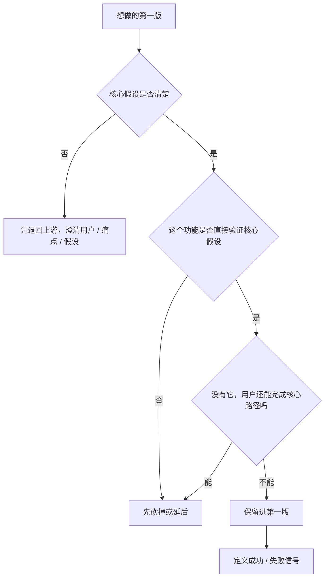

# MVP / 减法思维

## 这个框架什么时候用

当方向大致成立，但你需要收敛“第一版到底做什么、不做什么、验证什么”时，用 MVP / 减法思维。

它适合的场景：

- 想法已经有轮廓，但功能开始扩散
- 团队或个人在问“第一版到底先做什么”
- 你需要把方向判断落成可执行验证
- 想避免一上来就做成大而全系统

它的目标不是做一个“简陋版产品”，而是做一个能验证核心假设的最小可行版本。

## 什么时候别用

以下情况不要急着进入 MVP：

- 用户是谁还说不清
- 问题是不是真的存在还没判断
- 当前最主要的问题是方案真假，而不是功能收敛
- 你还没说清到底想验证哪一个核心假设

这时应先做：

- 灵魂三问
- 问题发现
- 必要时做 JTBD

## 先问哪几个高判别问题

### 1. 你到底想先验证什么

- 是验证用户是否真的有痛点
- 还是验证你的方案是否有效
- 还是验证用户是否愿意持续使用或付费

### 2. 哪个功能直接对应这个假设

- 没有它，假设还能不能被验证
- 如果能验证，这个功能就不该进第一版

### 3. 用户是否能完成一条完整路径

- 第一版是否能让用户从开始走到结果
- 哪些地方可以先手工替代，而不是系统化实现

### 4. 哪些功能只是让你更安心

- 是真正在验证价值
- 还是为了“看起来完整”

### 5. 第一轮成功看什么

- 看点击
- 看试用
- 看留存
- 看愿不愿意付钱

如果成功信号说不清，MVP 很容易退化成泛开发。

## 常见红旗

- 一次想验证所有假设
- 先做平台、系统、社区、生态
- 功能越删越焦虑，最后又全部加回去
- 没有用户完整路径，只有功能清单
- 把“工程完整”误当成“验证完整”
- 没有成功信号，只说“先做出来看看”

## 什么时候该停

出现以下情况时，不要继续排功能，而应先退回上游：

- 核心假设说不清
- 目标用户说不清
- 验证指标说不清
- 用户是否愿意切换仍然未知
- 所有功能都被说成“必须有”

停下后的动作：

- 先明确只验证一个核心假设
- 把用户路径画成最短闭环
- 把能手工替代的部分全部标出来
- 先定义成功 / 失败信号，再决定功能

## 最小验证动作

MVP 的最小验证，不一定是做完整产品。

常见验证方式：

- 落地页或等待名单：验证兴趣和点击
- 手工服务或半人工流程：验证用户是否真的愿意使用
- 简化工具或单点功能：验证方案有效性
- 预售或付费试探：验证付费意愿

最小成功信号：

- 用户完成了你定义的核心路径
- 你验证到了最重要的那个假设
- 用户给出的不是“挺好”，而是明确行动

最小失败信号：

- 用户看了但不行动
- 功能做了很多，仍然不知道验证了什么
- 数据或反馈无法对应到任何核心假设

## 输出时怎么写

推荐结构：

```markdown
## MVP 判断

### 现象
- 当前方向：
- 当前想做的功能：
- 当前最想验证的假设：

### 判断
- 核心假设是否清楚：是 / 否
- 第一版是否过重：是 / 否
- 当前最值得验证的点：

### 红旗
- [最关键的 1-3 个红旗]

### 动作
- [保留什么]
- [砍掉什么]
- [先验证什么]

### 最小验证
- [验证方式]
- [成功 / 失败信号]
```

## 一个短例子

```markdown
### 现象
- 想做一个帮助独立开发者管理用户反馈的工具
- 第一版想做反馈收集、标签系统、看板、AI 摘要、用户分群、自动路线图

### 判断
- 核心假设仍应先验证“开发者是否愿意集中管理反馈并持续回来查看”
- 当前第一版明显过重
- 真正值得先验证的是“反馈集中管理 + 快速回看”这一条路径

### 红旗
- 一次想验证太多价值点
- AI 摘要更像加分项，不是第一性验证点
- 还没验证持续使用，就先做复杂系统边界

### 动作
- 保留：反馈录入、统一列表、基础检索或标签
- 砍掉：自动路线图、复杂分群、社区化能力
- 先验证：用户是否愿意持续回到这个地方查看和整理反馈

### 最小验证
- 验证方式：做一个极简原型，让 3 到 5 个独立开发者连续一周使用
- 成功信号：至少 2 个用户连续回访并明确表示比现有方式更省心
- 失败信号：用户录入一次后不再回来，或继续用现有文档 / 表格
```

## 一个简单判断图


```mermaid
flowchart TD
    A["想做的第一版"] --> B{"核心假设是否清楚"}
    B -->|否| C["先退回上游，澄清用户 / 痛点 / 假设"]
    B -->|是| D{"这个功能是否直接验证核心假设"}
    D -->|否| E["先砍掉或延后"]
    D -->|是| F{"没有它，用户还能完成核心路径吗"}
    F -->|能| E
    F -->|不能| G["保留进第一版"]
    G --> H["定义成功 / 失败信号"]
```
