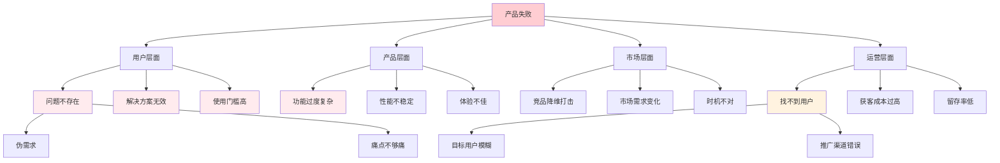
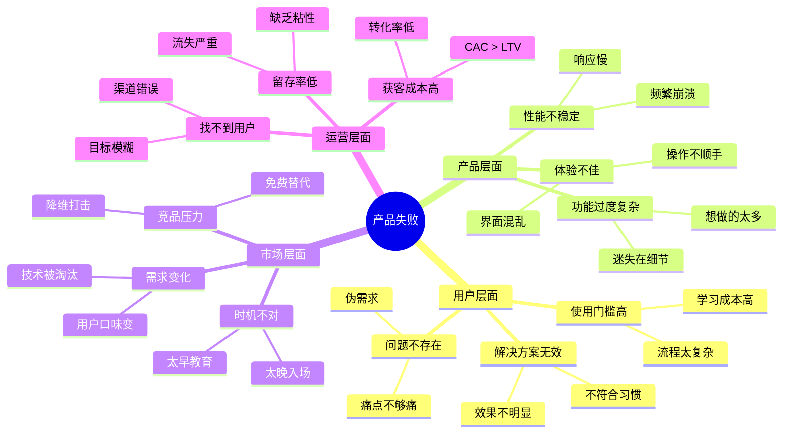

# 逆向思维（事前验尸）理论框架

## 核心概念

**事前验尸（Pre-mortem）**：在项目开始前，假设项目已经失败，倒推失败原因。

与传统"事后验尸"不同，事前验尸能在问题发生前预防它们。

## 常见失败模式

### 1. 问题不存在/不够痛
- 用户其实不care这个问题
- 痛点不够强烈，不值得切换解决方案
- 用户习惯了现状

**信号**：
- 用户说"挺有意思的"但没有行动
- 用户承诺试用但迟迟不开始

### 2. 解决方案不符合用户习惯
- 学习成本太高
- 与现有流程冲突
- 用户抗拒改变

**信号**：
- 用户需要频繁查看使用说明
- 用户抱怨"太复杂了"

### 3. MVP 过于复杂
- 想做的功能太多
- 验证周期太长
- 迷失在细节中

**信号**：
- 开发一个月还没推出
- 核心功能被次要功能挤占

### 4. 找不到用户
- 目标用户太模糊
- 推广渠道错误
- 用户场景不匹配

**信号**：
- 不知道去哪里找第一批用户
- 邀请测试没人理

## 实践方法

### 组织一场"事前验尸"会议

**时间**：30-60分钟
**参与者**：团队成员、潜在用户

**流程**：
1. **设定假设**："假设6个月后我们的产品失败了，大家觉得可能是什么原因？"
2. **个人思考**：每人写下3-5个失败原因（5分钟）
3. **汇总讨论**：收集所有原因，归类整理
4. **制定对策**：针对高风险项制定预防措施

### 输出模板

```markdown
## 事前验尸分析

### 失败假设
假设 [日期] 后产品失败了，可能的原因：

| 风险类别 | 失败原因 | 概率(高/中/低) | 预防措施 |
|----------|----------|----------------|----------|
| 需求风险 | | | |
| 产品风险 | | | |
| 推广风险 | | | |
| 技术风险 | | | |

### 优先应对的风险
1. [具体风险] → 对策：[具体行动]
```

## 可视化示例

### 风险分析树

展示产品失败的各种可能原因及其层级关系：



### 失败模式思维导图

可视化展示各类失败模式的详细分类：



### 风险评估矩阵

用表格形式展示各风险的概率和影响程度：

| 风险类别 | 具体风险 | 概率 | 影响 | 优先级 | 预防措施 |
|---------|---------|------|------|--------|----------|
| 需求风险 | 问题不存在 | 高 | 高 | 🔴 紧急 | 深度用户访谈验证 |
| 产品风险 | 功能过度复杂 | 中 | 高 | 🟡 重要 | 严格 MVP 范围控制 |
| 运营风险 | 找不到用户 | 中 | 高 | 🟡 重要 | 提前规划推广渠道 |
| 技术风险 | 性能不稳定 | 低 | 中 | 🟢 一般 | 技术方案评审 |
| 市场风险 | 竞品打击 | 中 | 中 | 🟢 一般 | 持续竞品监控 |

**使用建议**：
- 风险分析树：用于全面梳理可能的失败原因
- 失败模式思维导图：用于头脑风暴和团队讨论
- 风险评估矩阵：用于确定优先应对的风险项

## 实践技巧

### 问出真实想法
- "如果你是竞品，你会怎么攻击我们？"
- "什么情况下你会放弃使用这个产品？"
- "最可能让用户骂街的地方是什么？"

### 寻找早期信号
- 在用户测试中观察，不要只听用户怎么说
- 留意用户在哪一步卡住或放弃
- 记录用户的所有抱怨和吐槽

