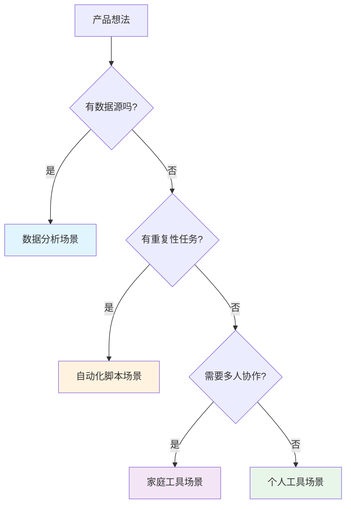
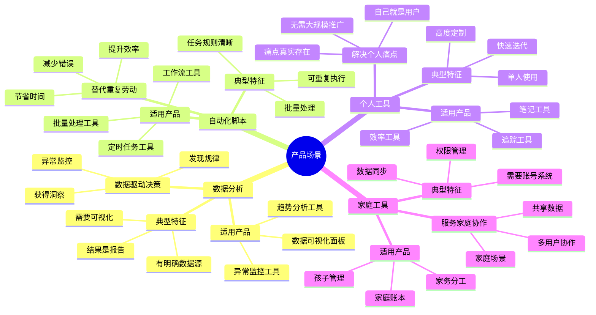
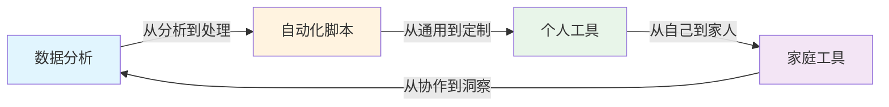

# 场景应用理论框架

## 核心概念

**产品想法需要找到合适的落地场景。**

四大应用场景：
1. 数据分析
2. 自动化脚本
3. 个人工具
4. 家庭工具

## 四大场景详解

### 1. 数据分析场景

**定义**：用数据驱动决策，帮助用户获得洞察。

**典型特征**：
- 有明确的数据源（日志、报表、公开数据等）
- 用户需要从数据中发现规律或异常
- 结果是"洞察"或"报告"

**适用产品**：
- 数据可视化面板
- 异常监控工具
- 趋势分析工具
- 数据对比工具

**案例**：
- 网站流量分析工具
- 个人消费分析工具
- 健康数据追踪工具

### 2. 自动化脚本场景

**定义**：用脚本替代重复性劳动。

**典型特征**：
- 有明确的重复性任务
- 任务规则清晰
- 目标是节省时间/减少错误

**适用产品**：
- 批量处理工具
- 定时任务工具
- 自动化工作流工具
- 数据抓取工具

**案例**：
- 批量重命名文件工具
- 自动备份脚本
- 批量图片处理工具
- 爬虫工具

### 3. 个人工具场景

**定义**：解决个人真实痛点。

**典型特征**：
- 用户就是自己
- 痛点真实存在
- 不需要大规模推广

**适用产品**：
- 效率工具
- 笔记工具
- 追踪工具
- 提醒工具

**案例**：
- 个人记账工具
- 习惯追踪器
- 阅读清单管理
- 密码管理器

### 4. 家庭工具场景

**定义**：服务家庭协作需求。

**典型特征**：
- 多用户协作
- 共享数据/状态
- 家庭场景使用

**适用产品**：
- 家庭账本
- 家务分工
- 孩子管理
- 家庭相册

**案例**：
- 家庭记账本
- 宝宝喂奶记录
- 家务清单
- 家庭购物清单

## 场景选择决策树

```
有数据源吗？
    ├─ 是 → 考虑数据分析场景
    │
    └─ 否 → 有重复性任务？
              ├─ 是 → 考虑自动化脚本场景
              │
              └─ 否 → 需要多人协作？
                        ├─ 是 → 考虑家庭工具场景
                        │
                        └─ 否 → 考虑个人工具场景
```

## 可视化示例

### 场景选择决策图

Mermaid 版本的场景选择决策流程：



### 四大场景思维导图

可视化展示四大场景及其特点：



### 场景切换图

展示不同场景之间的切换路径：



### 场景验证方法对比

| 场景 | 核心验证问题 | 验证方法 | 成功信号 |
|------|--------------|----------|----------|
| 数据分析 | 数据洞察对用户有价值吗？ | 让用户看分析报告，问是否有用 | 用户主动要更多数据 |
| 自动化脚本 | 能真正节省时间吗？ | 计时对比：手动 vs 自动化 | 用户重复使用 |
| 个人工具 | 自己会用吗？ | 自己先用一周 | 自己成为忠实用户 |
| 家庭工具 | 家人愿意用吗？ | 让家人试用，收集反馈 | 家人主动使用 |

**使用建议**：
- 场景选择决策图：用于快速判断产品想法适合哪个场景
- 四大场景思维导图：用于理解各场景的特点和适用范围
- 场景切换图：用于思考场景扩展和切换策略
- 场景验证方法对比：用于选择合适的验证方法

## 各场景的验证方法

| 场景 | 核心验证问题 | 验证方法 |
|------|--------------|----------|
| 数据分析 | 数据洞察对用户有价值吗？ | 让用户看分析报告，问是否有用 |
| 自动化脚本 | 能真正节省时间吗？ | 计时对比：手动 vs 自动化 |
| 个人工具 | 自己会用吗？ | 自己先用一周 |
| 家庭工具 | 家人愿意用吗？ | 让家人试用，收集反馈 |

## 场景切换建议

如果当前场景验证不理想，考虑切换：

| 当前场景 | 可尝试的场景 |
|----------|--------------|
| 数据分析 → 自动化脚本 | 从"分析"到"自动处理" |
| 自动化脚本 → 个人工具 | 从"通用工具"到"个人定制" |
| 个人工具 → 家庭工具 | 从"自己用"到"家人共享" |
| 家庭工具 → 数据分析 | 从"协作"到"数据洞察" |

## 实践技巧

### 1. 从小场景开始
- 不需要一开始就想做大场景
- 小场景验证成功后再扩展

### 2. 场景可以叠加
- 一个产品可以支持多个场景
- 例如：个人记账工具（个人）+ 家庭账本（家庭）

### 3. 保持场景聚焦
- 不要试图覆盖所有场景
- 选择1-2个最合适的场景深入

