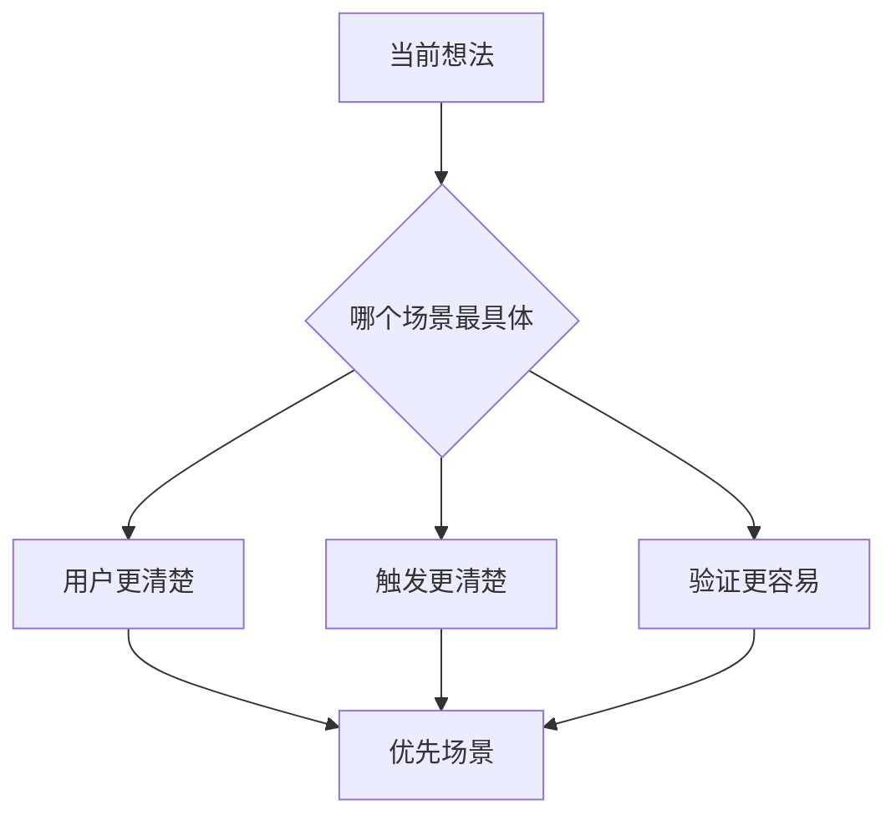

# 场景应用

## 这个框架什么时候用

当你手上有一个方向，但还不确定它最适合落在哪种具体场景时，用场景应用。

它适合的场景：

- 想法听起来成立，但落地位置不清
- 同一个能力可以服务很多人，你需要先收窄切口
- 不确定该先做成数据分析工具、自动化工具，还是个人工具
- 你想先找一个更容易验证的场景，而不是直接做成通用平台

它的目标不是给想法找尽可能多的场景，而是判断：

- 哪个场景最具体
- 哪个场景最容易先验证
- 哪个场景的用户、任务和成功信号最清楚

## 什么时候别用

以下情况不要把场景应用当主框架：

- 用户是谁还不清楚
- 问题真不真实还没验证
- 当前更需要的是收敛功能而不是换场景
- 当前更需要的是拆用户任务或评估失败风险

这时应先做：

- 灵魂三问
- 问题发现
- JTBD
- MVP / 逆向思维

## 先问哪几个高判别问题

### 1. 这个能力最适合在哪个具体情境里发生

- 是看数据
- 做重复任务
- 解决个人高频烦恼
- 做家庭或多人协作

### 2. 哪个场景的触发最具体

- 有没有明确数据源
- 有没有明确重复任务
- 有没有明确个人痛点
- 有没有明确协作对象

### 3. 哪个场景最容易先验证

- 最容易找到用户
- 最容易做最小版本
- 最容易看到成功 / 失败信号

### 4. 哪个场景最不容易一开始就做重

- 是否需要复杂权限
- 是否需要大规模分发
- 是否需要很多基础设施

### 5. 如果只选一个场景先做，哪个最能帮你学到东西

- 最能验证核心价值
- 最能快速得到真实反馈
- 最能避免一开始就做成泛平台

## 常见红旗

- 想一开始覆盖所有场景
- 看到多个场景都能讲通，就不愿意收窄
- 说“这个能力谁都能用”
- 选了一个最宏大、最难验证的场景起步
- 场景切换只是换名字，用户任务并没有更清楚

## 什么时候该停

出现以下情况时，不要继续扩写场景列表，应先停下来收窄：

- 目标用户仍然泛
- 每个场景都像“也许可以”
- 说不清哪个场景最容易验证
- 说不清哪个场景的成功信号最明确

停下后的动作：

- 只保留 1 到 2 个最具体的场景
- 明确每个场景的用户、任务和验证信号
- 优先选最容易找到用户、最容易看到反馈的切口

## 最小验证动作

场景应用的最小验证，不是把场景都分析一遍，而是快速试探哪个切口最容易成立。

推荐最小验证：

1. 选 1 到 2 个最可能成立的场景
2. 为每个场景写一句“谁在什么情况下需要什么结果”
3. 找对应用户快速确认这个场景是否真实存在

最小成功信号：

- 你能清楚说出场景里的用户、触发和结果
- 用户明确认同这个场景是高频或高痛的
- 你能看出哪个场景更容易先验证

最小失败信号：

- 场景只是抽象类别，没有具体触发
- 用户对场景反应平淡
- 选不出优先场景，说明切口仍然太泛

## 输出时怎么写

推荐结构：

```markdown
## 场景应用判断

### 现象
- 当前能力或想法：
- 当前候选场景：

### 判断
- 最值得先做的场景：
- 为什么是这个场景：
- 为什么不是另外几个场景：

### 红旗
- [最关键的 1-3 个红旗]

### 动作
- [下一步最值得做的动作]

### 最小验证
- [找谁验证]
- [验证什么]
- [成功 / 失败信号]
```

## 一个短例子

```markdown
### 现象
- 想做一个“帮人更快发现值得做的选品机会”的工具
- 候选场景包括：跨境电商、内容选题、股票研究、个人消费决策

### 判断
- 最值得先做的场景是跨境电商卖家选品
- 因为这个场景的用户更具体、数据源更明确、验证结果更容易看到
- 内容选题和股票研究虽然也能讲通，但用户任务更分散，第一版更容易做重

### 红旗
- 如果把“发现机会”讲成通用能力，很容易失去切口

### 动作
- 先找 3 到 5 个跨境卖家，确认他们现在如何做选品，以及最痛的环节是什么

### 最小验证
- 成功信号：多个卖家都认可某个具体选品场景是高频痛点
- 失败信号：所谓痛点过于分散，无法收敛成同一条验证路径
```

## 一个简单判断图


```mermaid
flowchart TD
    A["当前想法"] --> B{"哪个场景最具体"}
    B --> C["用户更清楚"]
    B --> D["触发更清楚"]
    B --> E["验证更容易"]
    C --> F["优先场景"]
    D --> F
    E --> F
```
