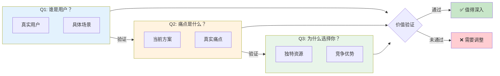
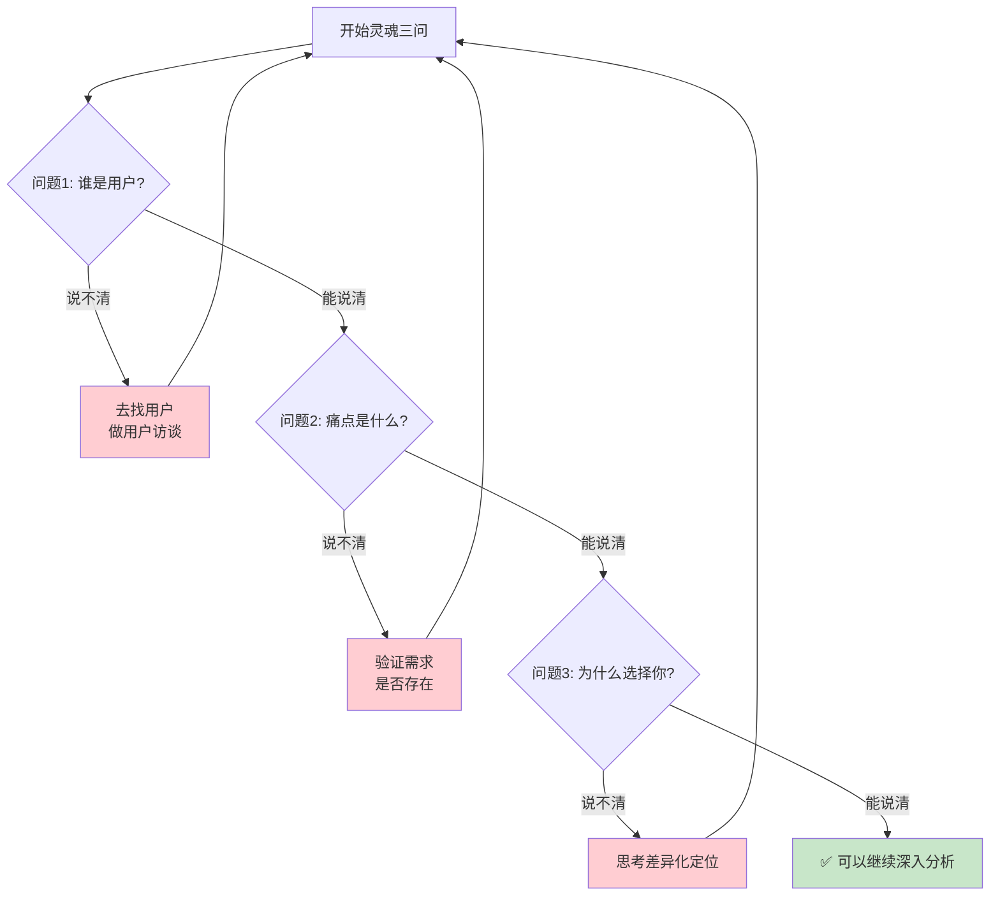
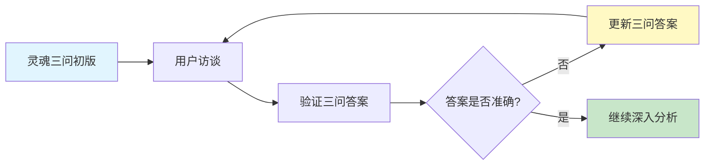

# 灵魂三问理论框架

## 核心概念

**三个简单但深刻的问题，快速判断产品想法的核心价值。**

1. **谁是用户？**（WHO）
2. **痛点是什么？**（WHAT PAIN）
3. **为什么选择你？**（WHY YOU）

## 三个问题的深层含义

### 问题 1：谁是用户？

不是问"用户有多少"或"用户画像是什么"，而是问：

- 你能具体描述一个真实用户吗？
- 你有这个用户的朋友/联系方式吗？
- 你见过这个用户的使用场景吗？

**红旗信号**：
- ❌ "所有人都是用户"
- ❌ "25-35岁的城市白领"（太泛）
- ❌ "我觉得...的用户"（没有真实接触）

**正确回答**：
- ✅ "我表妹，26岁，刚当妈妈，每天..."
- ✅ "我的一个同事，他每天..."
- ✅ "我在XX社区认识的几个用户..."

### 问题 2：痛点是什么？

不是问"功能是什么"，而是问：

- 用户现在有多痛苦？
- 用户为什么不得不解决这个问题？
- 用户现在怎么解决的？有什么不满意？

**红旗信号**：
- ❌ "用户没有这个工具不方便"
- ❌ "市场上没有同类产品"
- ❌ "我觉得用户需要..."

**正确回答**：
- ✅ "用户现在用手动记录，每周要花2小时整理"
- ✅ "用户用Excel，但经常忘记保存"
- ✅ "用户现在用XX工具，但每月要付50元，太贵"

### 问题 3：为什么选择你？

不是问"你有什么功能"，而是问：

- 你有什么独特资源/视角？
- 你为什么能做成这件事？
- 大厂为什么不直接做？

**红旗信号**：
- ❌ "我们界面更好看"
- ❌ "我们功能更强大"
- ❌ "我们会更努力"

**正确回答**：
- ✅ "我就是用户，深刻理解这个痛点"
- ✅ "我有XX资源，别人没有"
- ✅ "我在XX领域深耕X年，有独特洞察"

## 灵魂三问检查清单

```markdown
## 灵魂三问自查

### 1. 谁是用户？
- [ ] 能说出一个真实用户的名字
- [ ] 能描述用户的具体使用场景
- [ ] 有用户的联系方式，可以随时沟通
- [ ] 见过用户如何解决当前问题

### 2. 痛点是什么？
- [ ] 能说出用户现在的解决方案
- [ ] 能说出当前方案的具体痛点
- [ ] 痛点足够强烈，用户愿意尝试新方案
- [ ] 有数据或用户反馈支持

### 3. 为什么选择你？
- [ ] 能说出自己的独特优势
- [ ] 优势不是"更努力"或"更好看"
- [ ] 理解为什么大厂没做/没做好
- [ ] 有具体的行动计划

### 总体评估
- [ ] 三个问题都能清晰回答
- [ ] 有真实用户可以访谈
- [ ] 有信心开始下一步行动
```

## 快速判断流程

```
开始灵魂三问
    ↓
问题1：谁是用户？
    ├─ 说不清 → 去找用户，做用户访谈
    └─ 能说清 → 继续
              ↓
问题2：痛点是什么？
    ├─ 说不清 → 验证需求是否存在
    └─ 能说清 → 继续
              ↓
问题3：为什么选择你？
    ├─ 说不清 → 思考差异化定位
    └─ 能说清 → **可以继续深入分析**
```

## 可视化示例

### 三问关系图

展示灵魂三问之间的逻辑关系和验证路径：



### 快速判断流程图

Mermaid 版本的快速判断流程：



### 三问自查矩阵

用表格形式展示三问的评估标准：

| 问题 | 🟢 通过（可以继续） | 🟡 待定（需要验证） | 🔴 未通过（需要调整） |
|------|-------------------|-------------------|---------------------|
| **Q1: 谁是用户？** | 能说出真实用户名字<br/>有具体使用场景<br/>有联系方式 | 有目标人群描述<br/>但缺少真实接触<br/>需要用户访谈 | "所有人都是用户"<br/>只有人口统计学标签<br/>没有真实用户 |
| **Q2: 痛点是什么？** | 用户现在的方案明确<br/>痛点具体强烈<br/>有数据/反馈支持 | 似乎有痛点<br/>但不够具体<br/>需要深入验证 | "没有这个工具不方便"<br/>伪需求<br/>痛点不够痛 |
| **Q3: 为什么选择你？** | 有独特资源/视角<br/>理解为什么大厂没做好<br/>有具体行动 | 有一些优势<br/>但不够独特<br/>需要深入思考 | "界面更好看"<br/>"我们会更努力"<br/>没有差异化 |

### 三问验证闭环

展示三问如何形成持续验证的闭环：



**使用建议**：
- 三问关系图：用于理解三个问题之间的逻辑关系
- 快速判断流程图：用于快速评估产品想法
- 三问自查矩阵：用于团队评估和打分
- 三问验证闭环：用于理解持续验证的重要性

## 常见误区

| 误区 | 正确做法 |
|------|----------|
| 三问是一次性的 | 三问要反复验证，随着认知加深更新答案 |
| 答案是静态的 | 答案会随着用户访谈和测试变化 |
| 必须完美回答 | 有大致方向就可以，但要保持开放心态修正 |

