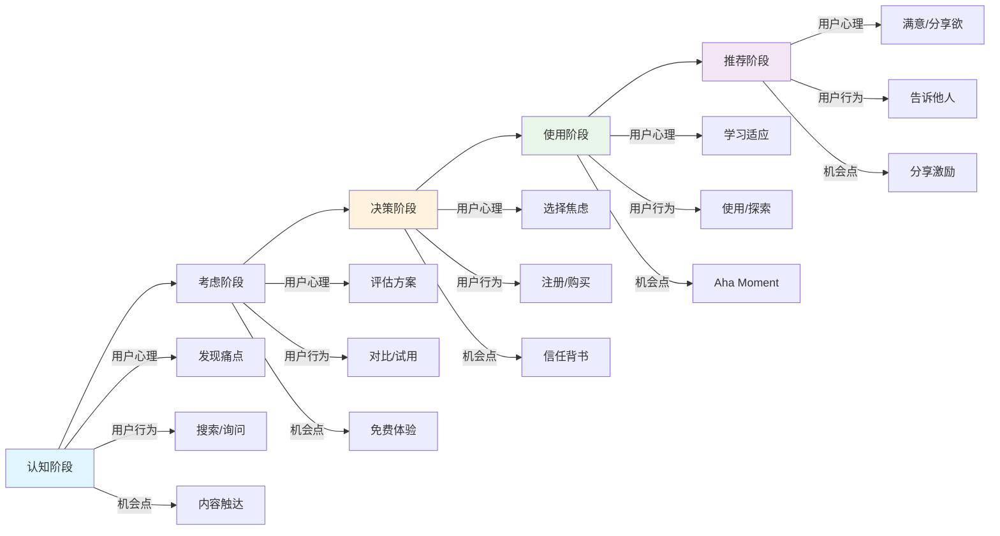
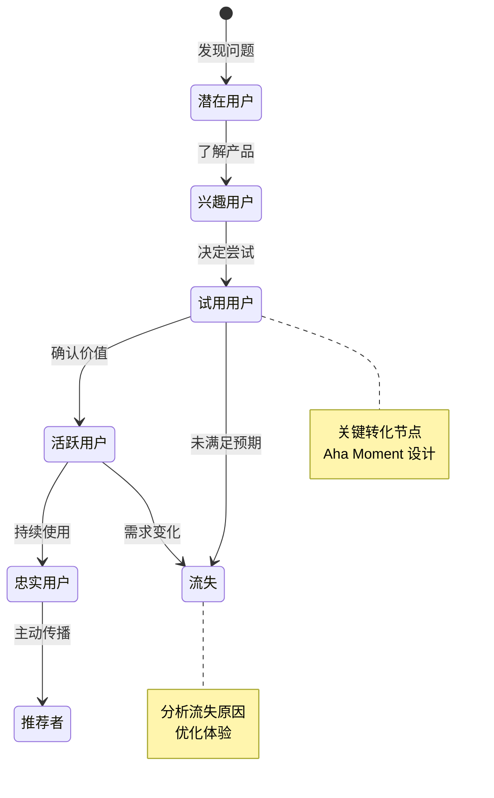
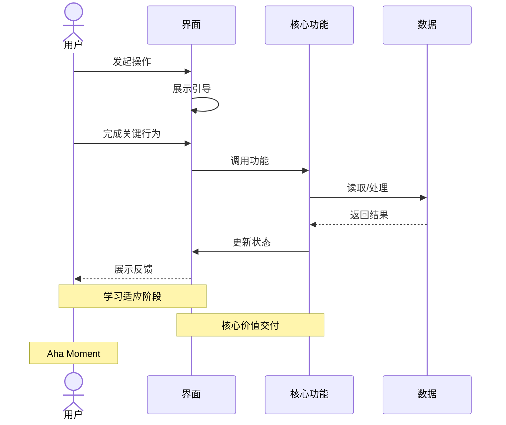
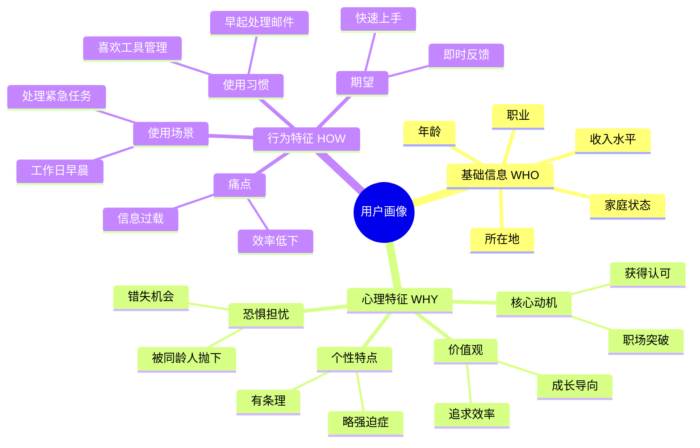

# 故事思维理论框架

## 核心概念

**产品是故事，用户是主角。**

用讲故事的思维方式设计产品：
- 用户是故事的主角
- 用户的痛点是故事的冲突
- 产品是帮助主角解决冲突的工具

## 三维用户画像

### 1. 基础信息（WHO）
表面可见的人口统计学特征。

**示例**：
- 年龄：28岁
- 职业：产品经理
- 所在地：北京
- 家庭状态：单身

### 2. 心理特征（WHY）
深层的动机、价值观、恐惧。

**示例**：
- 价值观：效率至上、追求成长
- 动机：想在职场脱颖而出
- 恐惧：被同龄人抛下
- 个性：有条理、略强迫症

### 3. 行为特征（HOW）
具体的使用场景和习惯。

**示例**：
- 工作日习惯早起处理邮件
- 喜欢用工具管理一切
- 对新工具有兴趣但嫌麻烦
- 愿意为效率付费

### 用户画像模板

```markdown
## 用户画像：[名字]

### 基础信息
- 年龄：[年龄]
- 职业：[职业]
- 所在地：[地点]
- 家庭状态：[状态]

### 心理特征
- 价值观：[核心价值观]
- 动机：[核心动机]
- 恐惧：[恐惧什么]
- 个性：[性格特点]

### 行为特征
- 使用场景：[具体场景]
- 使用习惯：[使用习惯]
- 痛点：[具体痛点]
- 期望：[期望结果]

### 典型语录
"[用户会说的话]"
```

## 可视化示例

### 用户旅程流程图

展示用户从"发现问题"到"推荐产品"的完整旅程：



### 用户状态流转图

展示用户与产品关系的演变：



### 用户与产品交互时序图

展示用户在典型场景下与产品的交互过程：



### 三维用户画像思维导图

可视化展示用户画像的三个维度：



**使用建议**：
- 用户旅程流程图：用于理解用户完整的使用路径和情绪变化
- 用户状态流转图：用于设计用户增长和留存策略
- 时序图：用于设计用户与产品的交互流程
- 三维用户画像思维导图：用于深入理解用户的真实需求

## 用户旅程地图

描述用户从"不知道产品"到"使用产品"再到"推荐产品"的完整旅程。

### 五个阶段

| 阶段 | 用户心理 | 用户行为 | 痛点 | 机会 |
|------|----------|----------|------|------|
| 认知 | 发现问题 | 搜索/询问 | 找不到解决方案 | 内容营销 |
| 考虑 | 评估方案 | 对比/试用 | 不确定哪个好 | 免费试用 |
| 决策 | 选择方案 | 注册/购买 | 怕选错 | 信任背书 |
| 使用 | 学习适应 | 使用/探索 | 学习成本高 | 引导教程 |
| 推荐 | 满意分享 | 告诉他人 | 忘了/懒得 | 分享激励 |

### 旅程地图模板

```markdown
## 用户旅程地图

### 阶段 1：[阶段名]
**用户心理**：[用户在想什么]
**用户行为**：[用户在做什么]
**痛点**：[遇到什么问题]
**机会**：[我们能做什么]

### 阶段 2：[阶段名]
...
```

## 故事板（Storyboard）

用视觉化方式讲述用户使用产品的故事。

```
┌─────────┬─────────┬─────────┬─────────┬─────────┐
│ 场景1   │ 场景2   │ 场景3   │ 场景4   │ 场景5   │
│ [图]    │ [图]    │ [图]    │ [图]    │ [图]    │
│ 发现问题 │ 寻找方案 │ 尝试使用 │ 遇到困难 │ 解决问题 │
└─────────┴─────────┴─────────┴─────────┴─────────┘
```

## 实践技巧

### 1. 观察真实用户
- 跟踪用户一天
- 记录用户行为细节
- 拍摄用户使用场景

### 2. 讲具体故事
- 避免"用户可能会..."
- 用"小明在什么时候..."
- 加入具体场景和细节

### 3. 寻找关键时刻
- 用户在哪一步卡住？
- 用户在哪一步露出笑容？
- 用户在哪一步放弃？

