# Mermaid 图表最佳实践

## 目录
- [为什么使用 Mermaid](#为什么使用-mermaid)
- [图表类型概览](#图表类型概览)
- [使用场景指南](#使用场景指南)
- [语法最佳实践](#语法最佳实践)
- [常见错误与解决方案](#常见错误与解决方案)
- [颜色与样式指南](#颜色与样式指南)
- [真实示例](#真实示例)
- [常见问题](#常见问题)

---

## 为什么使用 Mermaid

### 核心优势

1. **文本即图表**: 用纯文本描述图表,易于版本控制和协作
2. **自动布局**: 无需手动调整位置,Mermaid 自动优化布局
3. **易于维护**: 修改文本即可更新图表,无需重新绘制
4. **跨平台支持**: Markdown 文件中直接渲染,GitHub/GitLab/Notion 等平台原生支持
5. **可读性强**: 即使不渲染,文本本身也具有一定可读性

### 在 product-thinking 中的作用

- **可视化思维**: 将抽象的产品思考过程可视化
- **结构化表达**: 强制用户结构化思考问题
- **沟通工具**: 图表比文字更直观,便于团队沟通
- **文档完整性**: 每个分析工具都有对应的可视化图表

---

## 图表类型概览

product-thinking 使用以下 Mermaid 图表类型:

| 图表类型 | 用途 | 适用阶段 | 复杂度 |
|---------|------|---------|--------|
| **graph** | 流程图、决策树、关系图 | 所有阶段 | ⭐⭐ |
| **journey** | 用户旅程图 | JTBD 分析 | ⭐⭐⭐ |
| **gantt** | 时间线、功能规划 | MVP、综合分析 | ⭐⭐⭐ |
| **quadrantChart** | 四象限分析、优先级排序 | 场景分析、风险评估 | ⭐⭐ |
| **mindmap** | 思维导图、需求层次 | JTBD 分析 | ⭐⭐ |
| **pie** | 占比分析 | 资源分配 | ⭐ |

---

## 使用场景指南

### 1. graph (流程图)

**适用场景**:
- 阶段流程图 (Kickoff → Analysis → Execution → Review → Closing)
- 决策流程 (MVP 决策流程、场景选择流程)
- 状态转换 (项目状态、阶段状态)
- 模块关系 (系统架构、依赖关系)

**何时使用**:
- 需要展示步骤顺序
- 需要展示条件分支
- 需要展示并行流程
- 需要展示循环迭代

**示例场景**:
```markdown
## 分析框架图 (Kickoff 阶段)
## 完整性检查流程 (Review 阶段)
## 状态恢复流程 (State Management)
```

---

### 2. journey (用户旅程图)

**适用场景**:
- 用户完成任务的完整旅程
- 用户情绪变化曲线
- 触点分析

**何时使用**:
- JTBD 分析中理解用户任务
- 需要展示用户情绪变化
- 需要识别痛点和机会点

**示例场景**:
```markdown
## 用户旅程图 (JTBD 分析)
```

---

### 3. gantt (甘特图)

**适用场景**:
- 功能规划时间线
- MVP 开发计划
- 里程碑规划

**何时使用**:
- 需要展示时间维度
- 需要展示任务依赖
- 需要展示并行任务

**示例场景**:
```markdown
## 功能规划时间线 (综合分析)
## MVP 开发计划 (MVP 功能审视)
```

---

### 4. quadrantChart (四象限图)

**适用场景**:
- 场景优先级排序 (价值 vs 难度)
- 风险评估矩阵 (影响 vs 概率)
- 功能优先级 (重要性 vs 紧急性)

**何时使用**:
- 需要二维评估
- 需要优先级排序
- 需要可视化权衡

**示例场景**:
```markdown
## 场景优先级排序图 (场景应用分析)
## 风险矩阵图 (综合分析)
```

---

### 5. mindmap (思维导图)

**适用场景**:
- 三层需求分析 (功能层/情感层/社会层)
- 问题分解
- 概念层次

**何时使用**:
- 需要展示层次结构
- 需要展示概念关系
- 需要头脑风暴

**示例场景**:
```markdown
## 三层需求思维导图 (JTBD 分析)
```

---

## 语法最佳实践

### 1. graph 语法

#### 基础语法

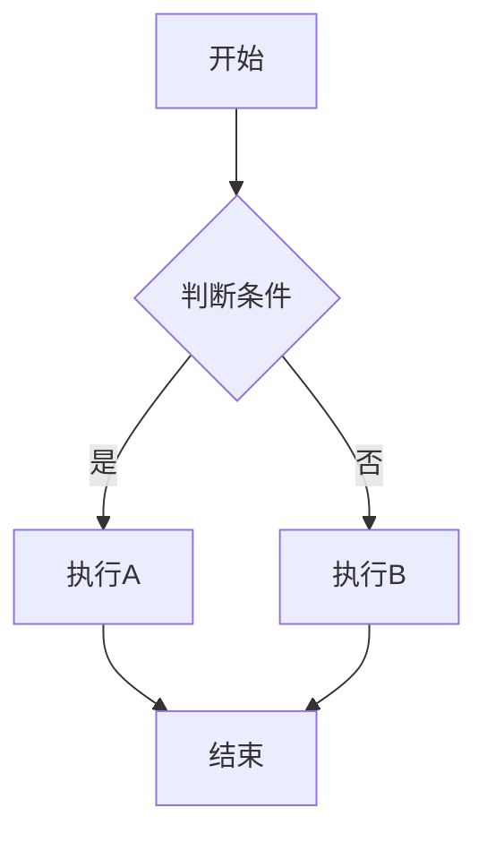

#### 节点形状

| 语法 | 形状 | 用途 |
|------|------|------|
| `A[文本]` | 矩形 | 普通步骤 |
| `A(文本)` | 圆角矩形 | 开始/结束 |
| `A{文本}` | 菱形 | 判断条件 |
| `A((文本))` | 圆形 | 状态 |
| `A>文本]` | 旗帜 | 里程碑 |

#### 连接线类型

| 语法 | 样式 | 用途 |
|------|------|------|
| `A --> B` | 实线箭头 | 顺序流程 |
| `A -.-> B` | 虚线箭头 | 可选流程 |
| `A ==> B` | 粗箭头 | 强调流程 |
| `A --- B` | 实线 | 关联关系 |

#### 标签

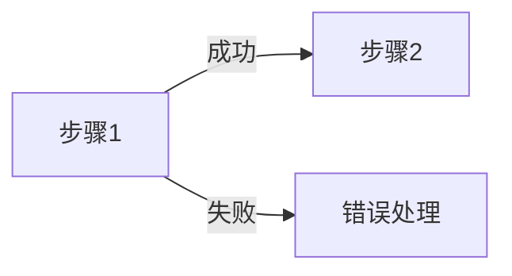

#### 子图

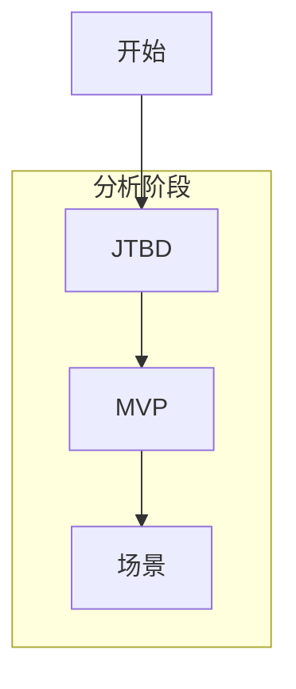

---

### 2. journey 语法

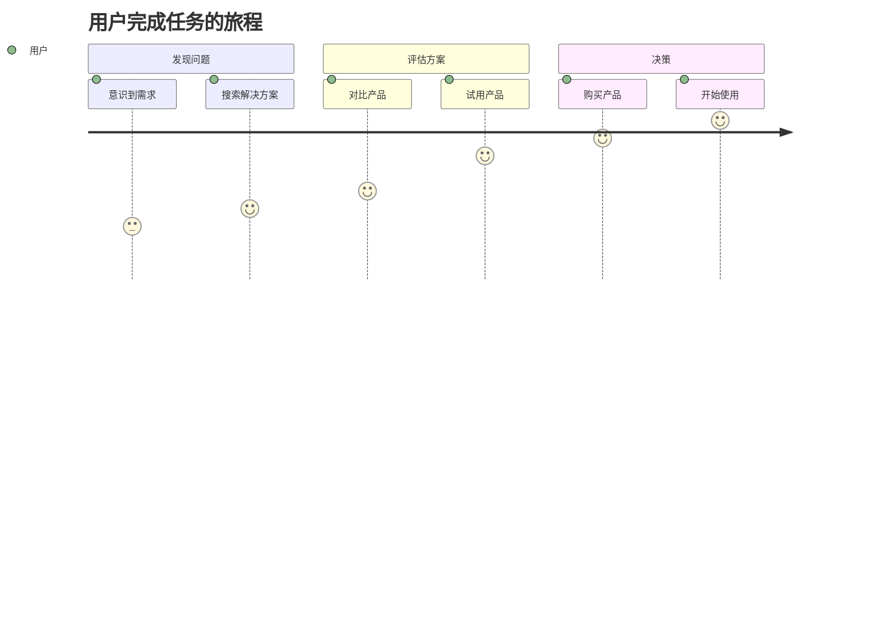

**关键点**:
- `title`: 旅程标题
- `section`: 阶段划分
- `任务: 满意度: 角色`: 满意度 1-10,数字越大越满意

---

### 3. gantt 语法

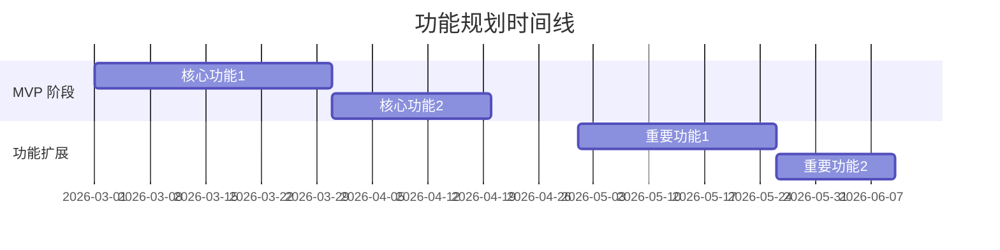

**关键点**:
- `dateFormat`: 日期格式
- `section`: 阶段划分
- `任务名 :id, 开始时间, 持续时间`: 任务定义
- `after id`: 依赖关系

---

### 4. quadrantChart 语法

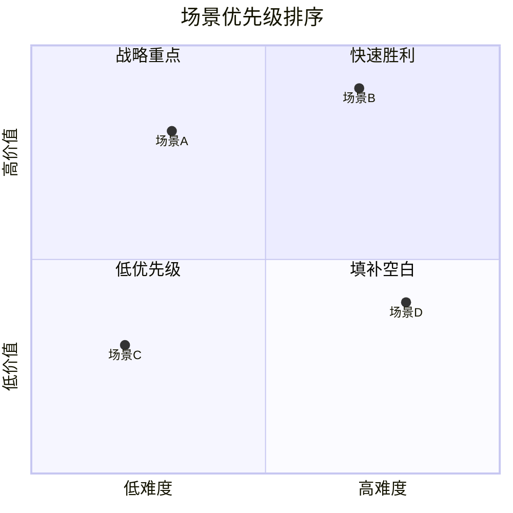

**关键点**:
- `x-axis`: X 轴标签
- `y-axis`: Y 轴标签
- `quadrant-N`: 象限标签 (1=右上, 2=左上, 3=左下, 4=右下)
- `项目名: [x, y]`: 坐标 (0-1 之间)

---

### 5. mindmap 语法

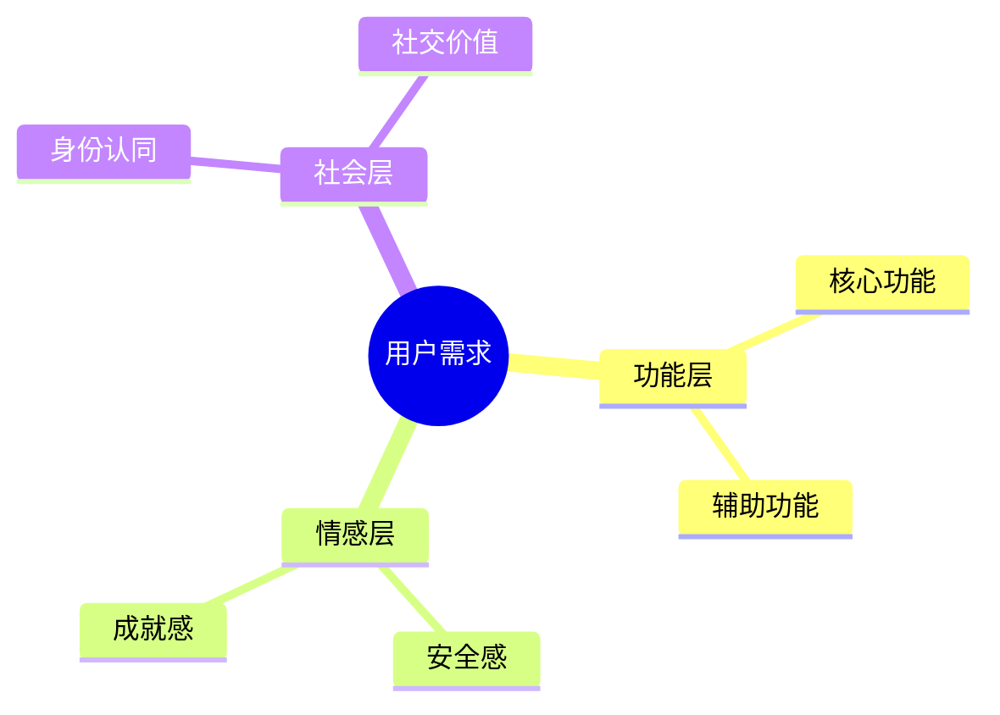

**关键点**:
- `root((文本))`: 根节点
- 缩进表示层级
- 支持多层嵌套

---

## 常见错误与解决方案

### 1. 语法错误

#### 错误: 节点 ID 包含特殊字符

❌ **错误示例**:
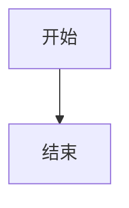

✅ **正确示例**:


**原因**: 节点 ID 不能包含中文和特殊字符 (除了下划线)

**解决方案**: 使用英文字母和数字作为节点 ID,中文放在方括号内

---

#### 错误: 箭头语法错误

❌ **错误示例**:
```mermaid
graph TD
    A -> B
    A => B
```

✅ **正确示例**:
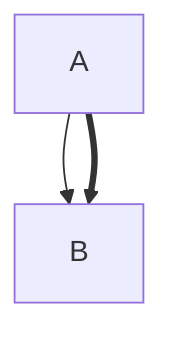

**原因**: Mermaid 使用 `-->` 和 `==>`,不是 `->` 和 `=>`

---

#### 错误: 标签中包含特殊字符未转义

❌ **错误示例**:
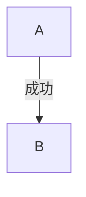

✅ **正确示例**:


**原因**: 标签不需要引号,直接写文本即可

---

### 2. 渲染问题

#### 问题: 图表不显示

**可能原因**:
1. Markdown 代码块标记错误 (应该是 ` ```mermaid ` 不是 ` ```mermaid-js `)
2. 语法错误导致渲染失败
3. 平台不支持 Mermaid

**解决方案**:
1. 检查代码块标记
2. 使用在线编辑器验证语法: https://mermaid.live/
3. 确认平台支持 Mermaid

---

#### 问题: 中文显示乱码

**可能原因**: 文件编码不是 UTF-8

**解决方案**: 确保 Markdown 文件使用 UTF-8 编码

---

#### 问题: 图表布局混乱

**可能原因**: 节点过多或关系过于复杂

**解决方案**:
1. 使用子图 (subgraph) 分组
2. 拆分为多个图表
3. 简化关系,只保留关键路径

---

### 3. 样式问题

#### 问题: 颜色不生效

❌ **错误示例**:


✅ **正确示例**:


**原因**: 颜色值需要使用十六进制格式

---

## 颜色与样式指南

### 1. 颜色使用原则

#### 语义化颜色

| 颜色 | 十六进制 | 用途 |
|------|---------|------|
| 蓝色 | `#e3f2fd` | 信息、流程 |
| 绿色 | `#c8e6c9` | 成功、完成 |
| 黄色 | `#fff3e0` | 警告、待定 |
| 红色 | `#ffcdd2` | 错误、风险 |
| 紫色 | `#e1bee7` | 特殊、强调 |
| 灰色 | `#f5f5f5` | 禁用、次要 |

#### 阶段颜色

在 product-thinking 中,每个阶段使用固定颜色:

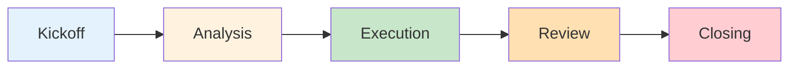

---

### 2. 样式语法

#### 单个节点样式


**样式属性**:
- `fill`: 填充颜色
- `stroke`: 边框颜色
- `stroke-width`: 边框宽度
- `color`: 文字颜色

---

#### 批量样式

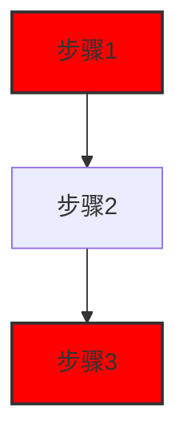

**优势**: 定义一次,多处使用

---

### 3. 样式最佳实践

#### ✅ 推荐做法

1. **使用语义化颜色**: 绿色表示成功,红色表示错误
2. **保持一致性**: 同类节点使用相同颜色
3. **避免过度装饰**: 颜色不超过 3-4 种
4. **考虑可访问性**: 确保颜色对比度足够

#### ❌ 避免做法

1. **随意使用颜色**: 没有语义,纯粹装饰
2. **颜色过多**: 超过 5 种颜色,视觉混乱
3. **对比度不足**: 浅色背景 + 浅色文字
4. **忽略色盲用户**: 仅依赖颜色区分信息

---

## 真实示例

### 示例 1: 分析框架图 (Kickoff 阶段)

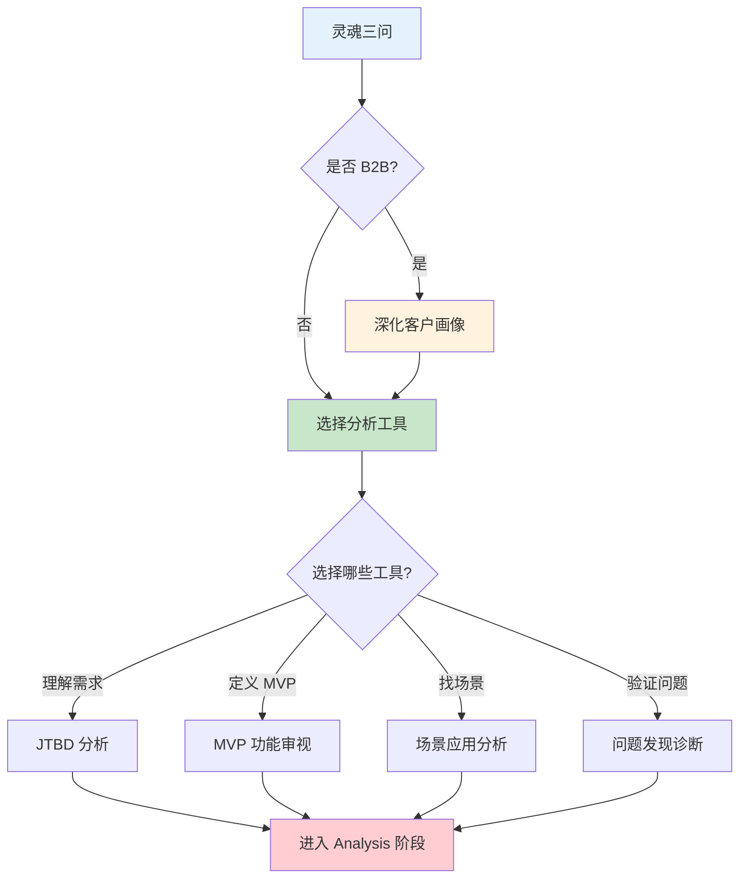

**设计要点**:
- 使用菱形表示判断节点
- 使用不同颜色区分阶段
- 标签说明分支条件

---

### 示例 2: 用户旅程图 (JTBD 分析)

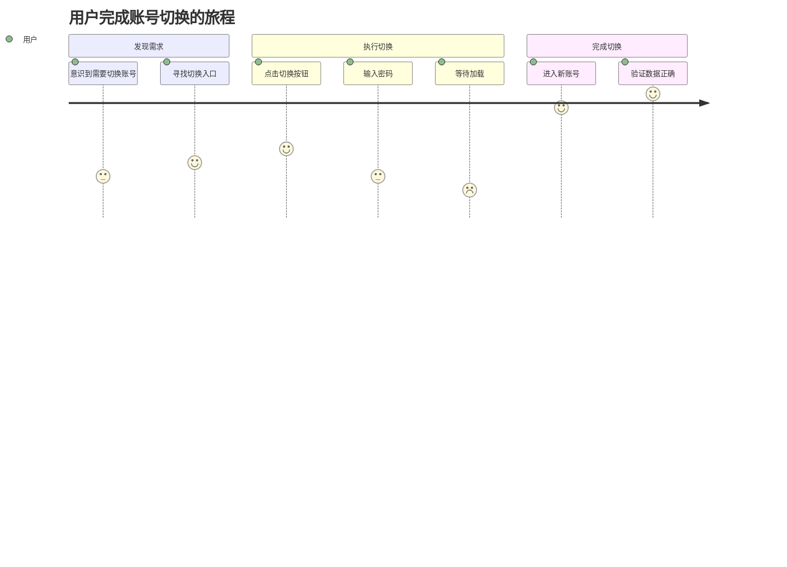

**设计要点**:
- 满意度曲线反映用户情绪
- 识别低满意度环节 (痛点)
- 识别高满意度环节 (亮点)

---

### 示例 3: 功能规划时间线 (综合分析)

```mermaid
gantt
    title 功能规划时间线
    dateFormat YYYY-MM-DD
    section MVP 阶段
    核心功能: 账号切换    :a1, 2026-03-01, 30d
    核心功能: 密码管理    :a2, after a1, 20d
    核心功能: 数据同步    :a3, after a2, 25d
    section 功能扩展
    重要功能: 生物识别    :b1, 2026-05-15, 20d
    重要功能: 多设备同步  :b2, after b1, 15d
    section 生态完善
    可选功能: 团队协作    :c1, 2026-07-01, 30d
    可选功能: API 开放    :c2, after c1, 20d
```

**设计要点**:
- 使用 section 区分阶段
- 使用 after 表示依赖关系
- 时间跨度反映开发周期

---

### 示例 4: 场景优先级排序图 (场景应用分析)

```mermaid
quadrantChart
    title 场景优先级排序
    x-axis 低实现难度 --> 高实现难度
    y-axis 低用户价值 --> 高用户价值
    quadrant-1 快速胜利
    quadrant-2 战略重点
    quadrant-3 低优先级
    quadrant-4 填补空白
    个人账号切换: [0.3, 0.9]
    企业账号切换: [0.7, 0.8]
    临时访客模式: [0.2, 0.4]
    多设备同步: [0.8, 0.7]
```

**设计要点**:
- 右上象限 (战略重点): 高价值高难度,长期投入
- 左上象限 (快速胜利): 高价值低难度,优先实现
- 右下象限 (填补空白): 低价值高难度,谨慎评估
- 左下象限 (低优先级): 低价值低难度,暂缓实现

---

### 示例 5: 三层需求思维导图 (JTBD 分析)

```mermaid
mindmap
  root((用户需求))
    功能层
      快速切换账号
        一键切换
        记住密码
      数据隔离
        独立存储
        安全加密
    情感层
      安全感
        数据不丢失
        隐私保护
      效率感
        节省时间
        减少重复操作
    社会层
      专业形象
        工作生活分离
        多角色管理
      身份认同
        不同场景不同身份
```

**设计要点**:
- 根节点是核心概念
- 第一层是需求层次 (功能/情感/社会)
- 第二层是具体需求
- 第三层是需求细节

---

## 常见问题

### Q: 如何选择合适的图表类型?

**A**: 根据要表达的内容选择:
- **流程/步骤** → graph
- **用户体验** → journey
- **时间规划** → gantt
- **优先级/权衡** → quadrantChart
- **层次结构** → mindmap

### Q: 图表太复杂怎么办?

**A**:
1. **拆分**: 一个复杂图表拆成多个简单图表
2. **分层**: 使用 subgraph 分组
3. **简化**: 只保留关键路径,细节用文字说明

### Q: 如何保持图表一致性?

**A**:
1. **统一颜色**: 同类节点使用相同颜色
2. **统一形状**: 同类节点使用相同形状
3. **统一方向**: 流程图统一从上到下或从左到右
4. **统一命名**: 节点 ID 使用统一命名规范

### Q: Mermaid 图表在不同平台显示不一致怎么办?

**A**:
1. **避免复杂样式**: 不同平台对样式支持不同
2. **使用基础语法**: 基础语法兼容性最好
3. **测试多平台**: 在目标平台测试渲染效果
4. **提供文本说明**: 图表无法渲染时,文字说明仍然有效

### Q: 如何调试 Mermaid 语法错误?

**A**:
1. **使用在线编辑器**: https://mermaid.live/ 实时预览
2. **逐步添加**: 先写基础结构,再逐步添加细节
3. **检查常见错误**: 节点 ID、箭头语法、引号使用
4. **查看错误信息**: 大多数平台会显示语法错误位置

### Q: 如何让图表更美观?

**A**:
1. **合理使用颜色**: 3-4 种颜色足够
2. **保持简洁**: 不要过度装饰
3. **对齐节点**: 使用 subgraph 对齐
4. **统一风格**: 整个项目使用统一的样式

### Q: 图表中的中文显示不正常怎么办?

**A**:
1. **检查文件编码**: 确保使用 UTF-8
2. **检查平台支持**: 确认平台支持中文
3. **使用英文 ID**: 节点 ID 使用英文,标签使用中文

### Q: 如何在图表中添加链接?

**A**:
```mermaid
graph TD
    A[步骤1]
    click A "https://example.com" "点击查看详情"
```

**注意**: 不是所有平台都支持点击链接

---

## 检查清单

在创建 Mermaid 图表前,检查:

- [ ] 选择了合适的图表类型
- [ ] 节点 ID 使用英文字母和数字
- [ ] 箭头语法正确 (`-->` 不是 `->`)
- [ ] 颜色使用十六进制格式
- [ ] 颜色有语义,不超过 4 种
- [ ] 图表不过于复杂 (节点 < 15 个)
- [ ] 使用了 subgraph 分组 (如果需要)
- [ ] 在 mermaid.live 验证过语法
- [ ] 文件使用 UTF-8 编码
- [ ] 与项目其他图表风格一致

---

**维护者**: 507
**创建时间**: 2026-02-12T01:30:00Z
**基于**: product-thinking 项目中的 Mermaid 图表实践
