# Mermaid 图示例

本文档提供适用于产品分析的各类 Mermaid 图示例，帮助在分析报告中添加可视化元素。

---

## 图表类型速查

| 图表类型 | 适用场景 | 语法关键词 |
|---------|---------|-----------|
| **流程图 Flowchart** | 用户旅程、决策流程、操作步骤 | `graph` 或 `flowchart` |
| **状态图 State Diagram** | 用户状态流转、产品生命周期 | `stateDiagram-v2` |
| **时序图 Sequence Diagram** | 用户与产品交互、系统组件协作 | `sequenceDiagram` |
| **类图 Class Diagram** | 产品模块关系、数据模型 | `classDiagram` |
| **ER 图** | 实体关系、数据结构 | `erDiagram` |
| **甘特图 Gantt Chart** | 产品路线图、开发计划 | `gantt` |
| **饼图 Pie Chart** | 用户构成、功能占比 | `pie` |
| **思维导图 Mindmap** | 头脑风暴、功能分解 | `mindmap` |

---

## 1. 流程图（Flowchart）

### 1.1 用户旅程流程图

**适用场景**：JTBD 分析、用户旅程分析

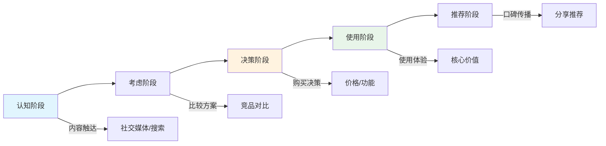

### 1.2 产品决策流程图

**适用场景**：减法思维、MVP 功能筛选

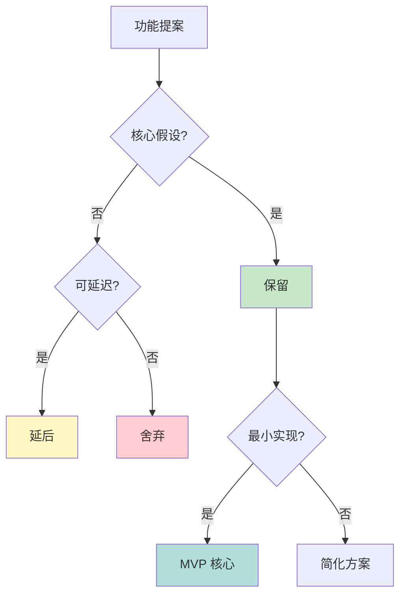

### 1.3 风险分析树（逆向思维）

**适用场景**：逆向思维（事前验尸）、风险评估

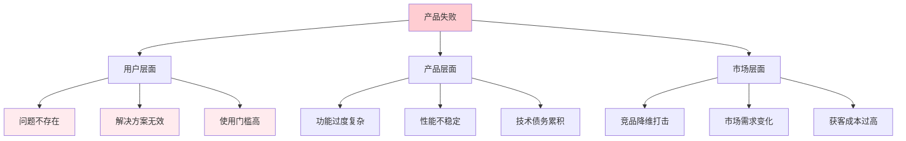

### 1.4 场景匹配矩阵（思维导图风格）

**适用场景**：场景应用分析

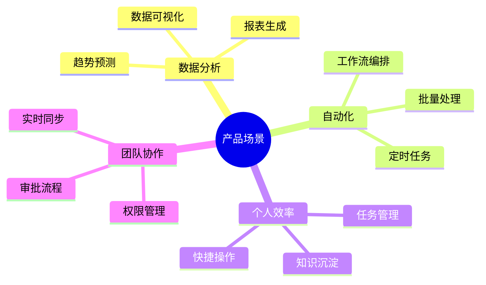

---

## 2. 状态图（State Diagram）

### 2.1 用户生命周期状态图

**适用场景**：用户增长分析、流失分析

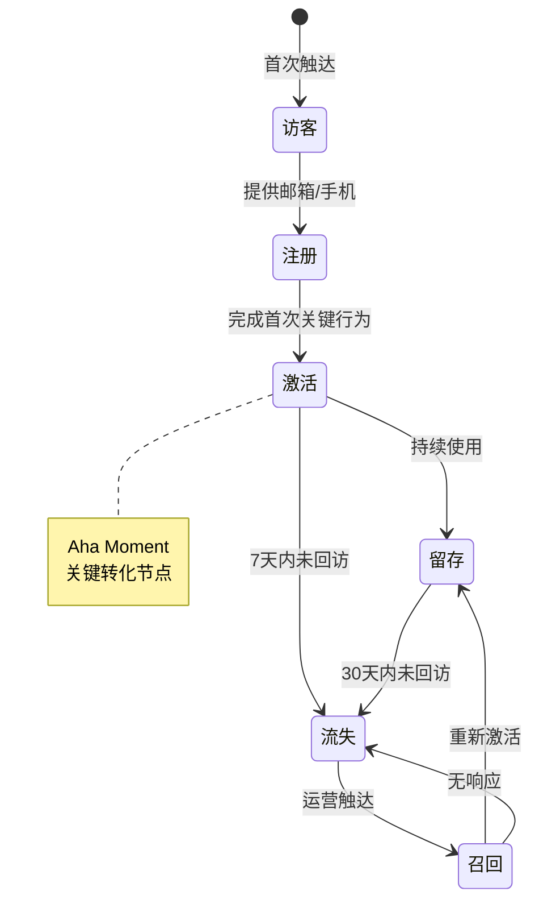

### 2.2 订单/任务状态图

**适用场景**：业务流程分析、状态流转设计

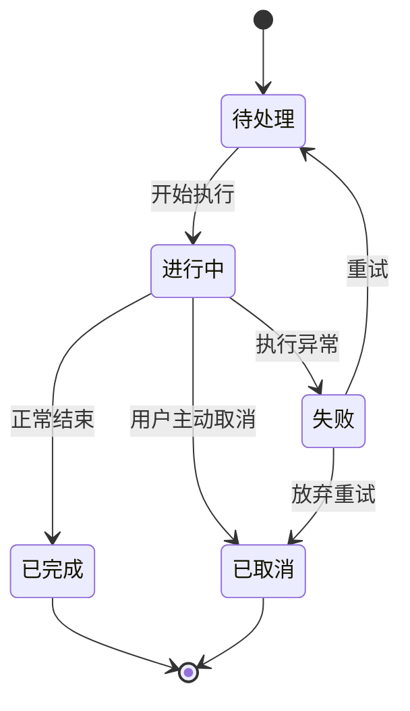

---

## 3. 时序图（Sequence Diagram）

### 3.1 用户与产品交互时序图

**适用场景**：故事思维、用户场景分析

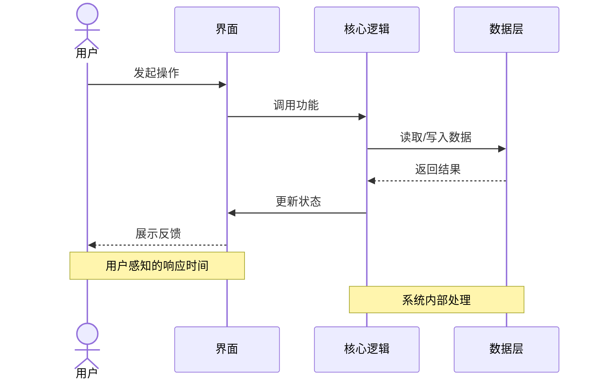

### 3.2 多角色协作时序图

**适用场景**：B2B 产品、社交产品、平台产品

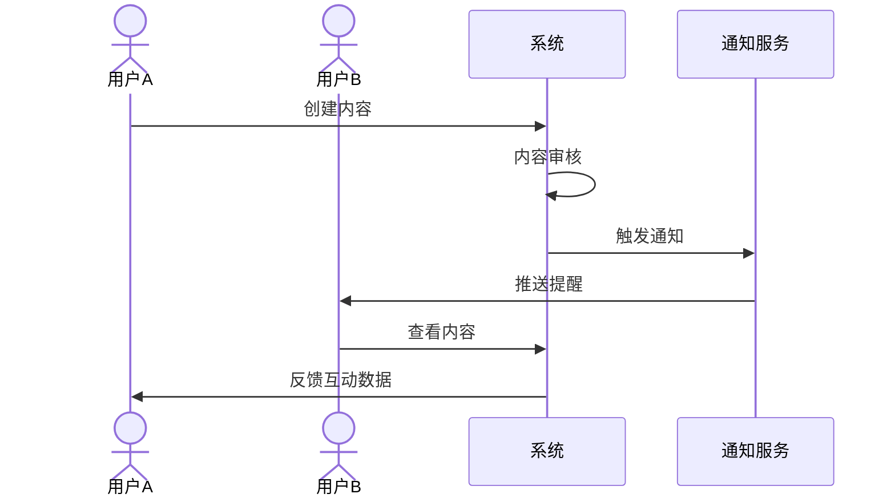

---

## 4. 类图（Class Diagram）

### 4.1 产品模块关系图

**适用场景**：系统架构分析、功能模块设计

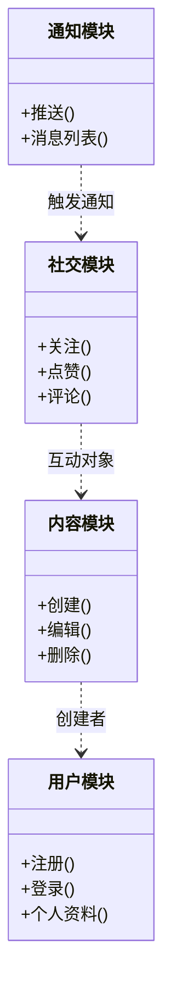

### 4.2 数据模型关系图

**适用场景**：数据结构设计、实体关系分析

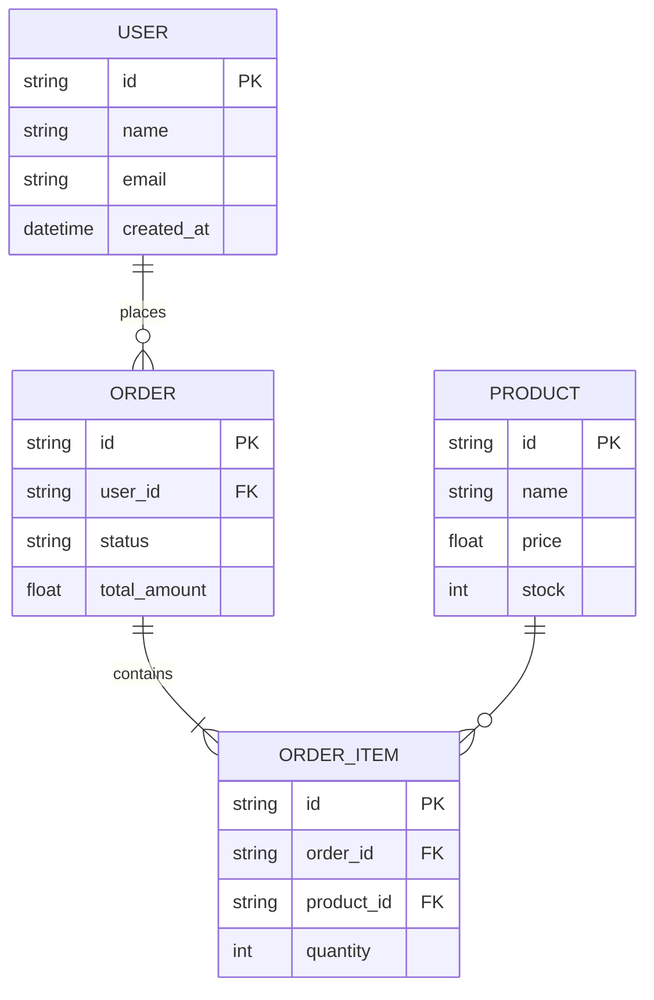

---

## 5. 甘特图（Gantt Chart）

### 5.1 产品路线图

**适用场景**：产品规划、里程碑设定

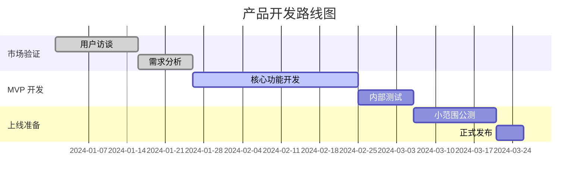

---

## 6. 饼图（Pie Chart）

### 6.1 用户构成分析

**适用场景**：用户画像分析、市场定位

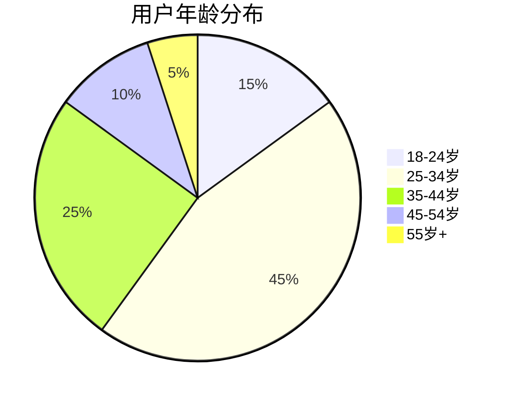

### 6.2 功能使用占比

**适用场景**：功能优先级判断、资源分配

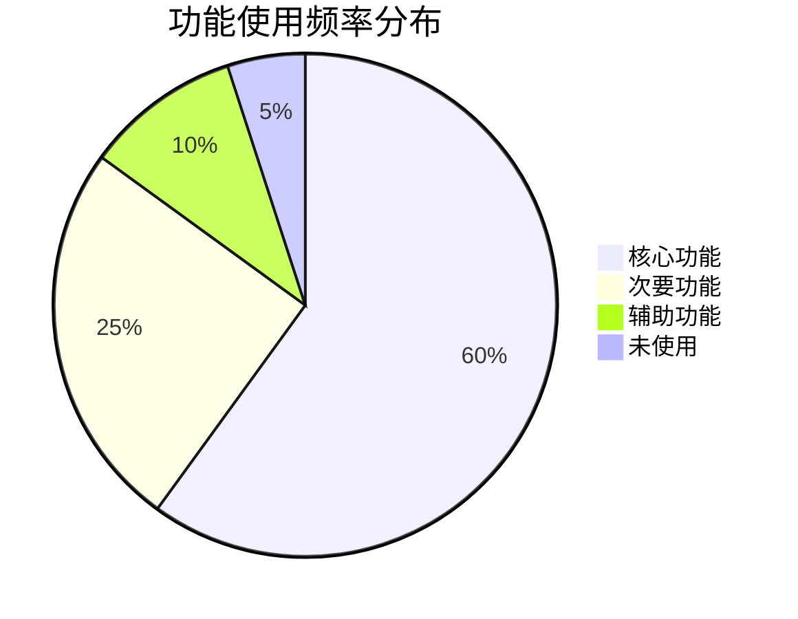

---

## 7. 综合示例：完整产品分析

### 7.1 灵魂三问可视化

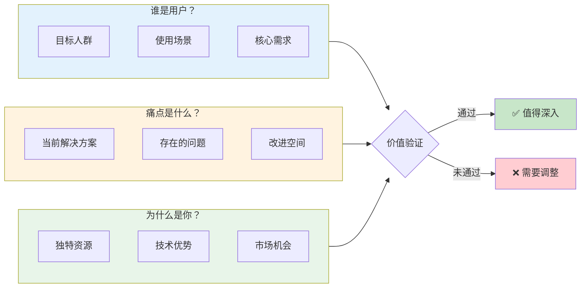

### 7.2 JTBD 三层需求分析

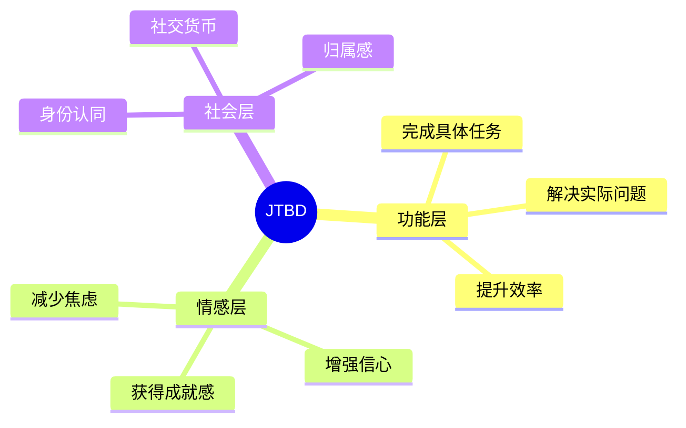

---

## 使用建议

### 何时使用流程图
- 用户旅程分析
- 决策路径梳理
- 风险因素分解
- 功能筛选逻辑

### 何时使用状态图
- 用户生命周期分析
- 业务状态流转设计
- 订单/任务流程
- 用户增长漏斗

### 何时使用时序图
- 用户交互场景描述
- 系统协作关系
- 多角色业务流程
- API 交互设计

### 何时使用类图/ER 图
- 产品模块设计
- 数据模型规划
- 系统架构梳理
- 功能边界划分

### 何时使用思维导图
- 头脑风暴
- 功能分解
- 场景分类
- 竞品分析

---

## 最佳实践

1. **简洁优先**：不要过度复杂化，能用简单图表表达就不用复杂的
2. **突出重点**：用颜色、样式突出关键节点
3. **层次清晰**：复杂流程可以拆分成多个图表
4. **保持一致**：同一份报告中使用统一的图表风格
5. **文字配合**：图表要有标题和必要的说明文字
