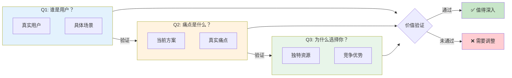
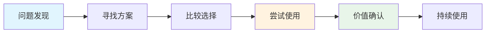
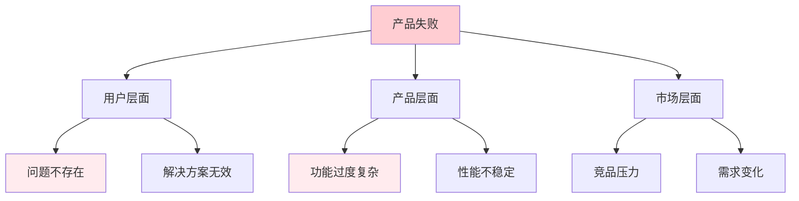
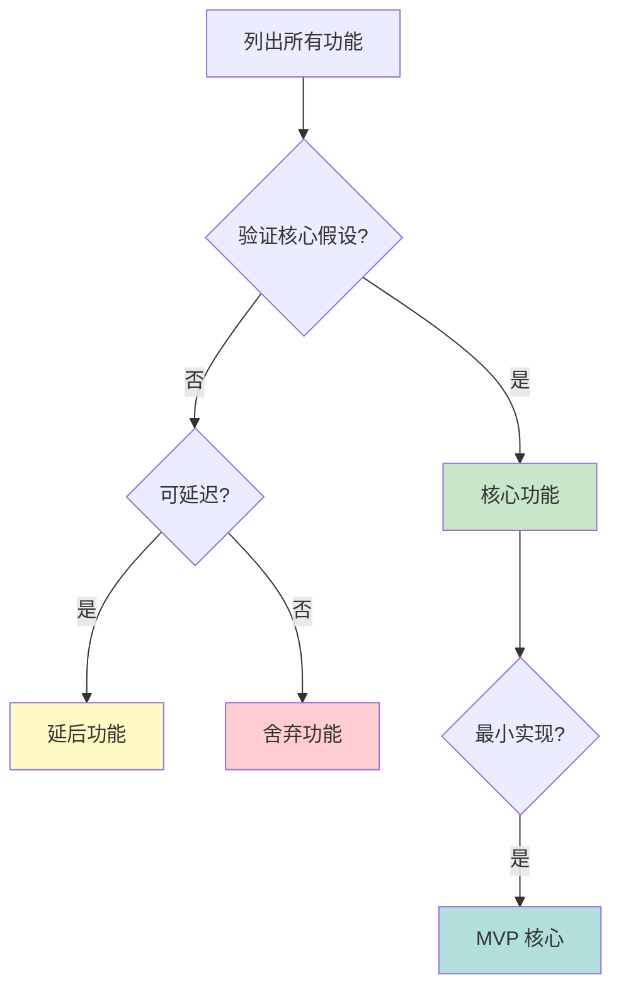
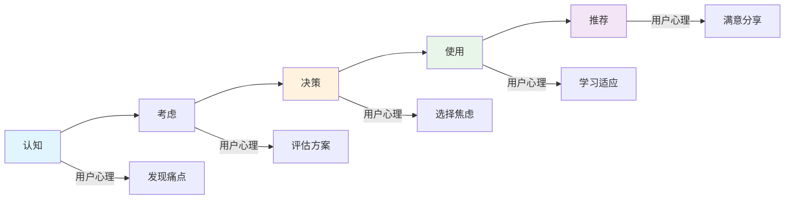

# 产品分析：[产品名称]

## 灵魂三问（快速评估）

### 三问关系图

---

### 1. 谁是用户？

**用户画像**：
- 具体描述一个真实用户
- 年龄/职业/场景
- 有用户的联系方式吗？

---

### 2. 痛点是什么？

**当前方案**：
- 用户现在如何解决这个问题？

**痛点描述**：
- 具体哪里不爽？
- 用户愿意为此付出什么？

---

### 3. 为什么选择你？

**独特优势**：
- 你有什么资源/视角/经验？
- 为什么大厂没做/没做好？

---

## 深度分析（选用）

*根据需求选择适用的思维工具*

### JTBD 分析

**功能层任务**：

**情感层任务**：

**社会层任务**：

**用户旅程流程图**：

---

### 事前验尸（逆向思维）

**假设6个月后产品失败了，可能的原因**：

**风险分析树**：

| 风险类别 | 失败原因 | 预防措施 |
|----------|----------|----------|
| 需求风险 | | |
| 产品风险 | | |
| 推广风险 | | |

---

### MVP 设计

**核心假设**：
1.
2.
3.

**MVP 功能**：
- [ ]
- [ ]
- [ ]

**砍掉的功能（后续迭代）**：
-

**功能筛选流程图**：

---

### 用户画像（故事思维）

**基础信息**：

**心理特征**：

**行为特征**：

**典型语录**："..."

---

### 用户旅程

**用户旅程流程图**：

| 阶段 | 用户心理 | 用户行为 | 痛点 | 机会 |
|------|----------|----------|------|------|
| 认知 | | | | |
| 考虑 | | | | |
| 决策 | | | | |
| 使用 | | | | |
| 推荐 | | | | |

---

## 结论与建议

### 核心发现

### 风险提示

### 下一步行动

---
*本分析由产品思维技能生成*
