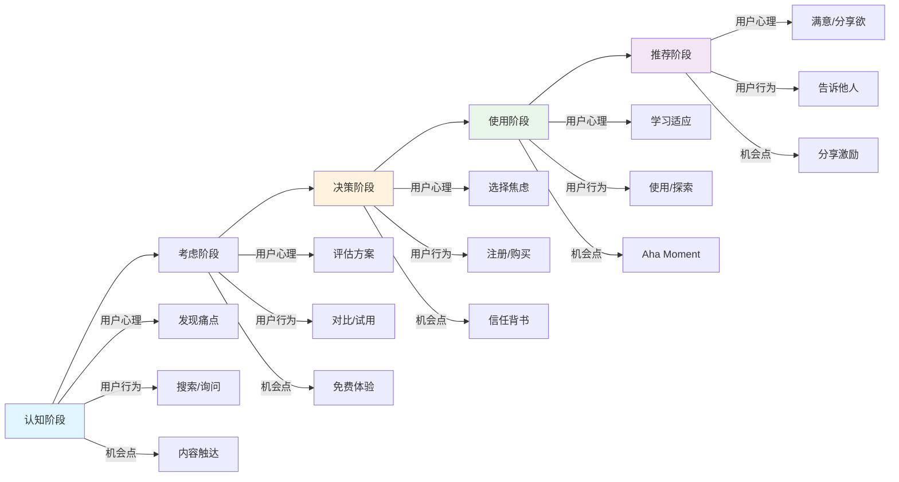
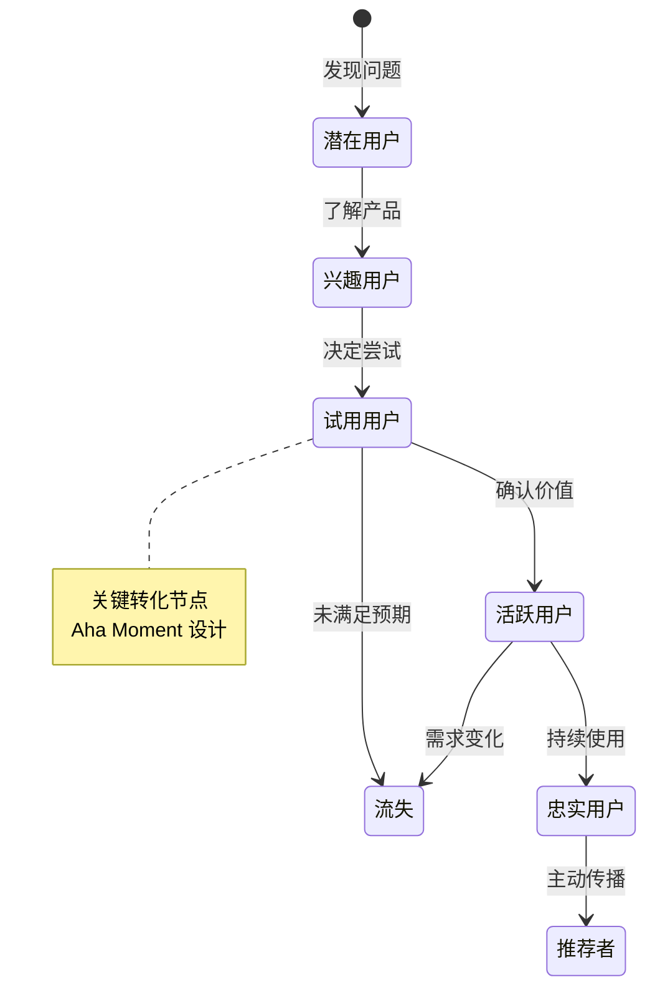

# 用户旅程地图

## 产品/服务名称
[产品名称]

## 用户画像
[使用哪个用户画像]

---

## 旅程阶段

### 阶段 1：认知

**用户心理**：[用户在想什么]
**用户行为**：[用户在做什么]
**触点**：[用户在哪里接触相关信息]
**痛点**：[遇到什么问题]
**机会**：[我们能做什么]

---

### 阶段 2：考虑

**用户心理**：
**用户行为**：
**触点**：
**痛点**：
**机会**：

---

### 阶段 3：决策

**用户心理**：
**用户行为**：
**触点**：
**痛点**：
**机会**：

---

### 阶段 4：使用

**用户心理**：
**用户行为**：
**触点**：
**痛点**：
**机会**：

---

### 阶段 5：推荐（可选）

**用户心理**：
**用户行为**：
**触点**：
**痛点**：
**机会**：

---

## 旅程可视化

### 用户旅程流程图



### 用户状态流转图



### 旅程可视化（传统格式）

```
┌─────────┬─────────┬─────────┬─────────┬─────────┐
│ 认知    │ 考虑    │ 决策    │ 使用    │ 推荐    │
│ [图标]  │ [图标]  │ [图标]  │ [图标]  │ [图标]  │
│ [简述]  │ [简述]  │ [简述]  │ [简述]  │ [简述]  │
└─────────┴─────────┴─────────┴─────────┴─────────┘
```

---

## 关键洞察

### 痛点总结
1. [痛点1]
2. [痛点2]

### 机会总结
1. [机会1]
2. [机会2]

### 优先改进项
1. [优先级1]
2. [优先级2]

---

*创建日期：[日期]*
*最后更新：[日期]*
